# 1. 简介

通常在一些企业中不单单存在WEB网站可能也会存在APP软件与小程序等，这些都是为了更好的为用户提供服务，但同时也会存在很多安全问题。

目前APP应用主要分为Android与iOS，但是由于苹果的iOS操作系统不是开源的，操作系统相较Android比较封闭，同时在对iOS系统进行反编译的时候会比较困难，所以一边对APP系统进行渗透测试都是在Android中进行测试。

## 1.1. APK介绍

APK是Android的应用程序包，当然你说它是安装包也可以，主要就是用于分发与安全移动应用及中间件。

## 1.2. APP渗透测试介绍

从本质上来说APP渗透测试与WEB渗透测试基本上是没什么区别的，APP应用其实就是将WEB网站集成到APP中，简单来说，你用电脑去访问一个页面是"/index.php",如果这个页面中存在相关的漏洞，那么你用手机去访问APP中这个页面，那么也会存在相关的漏洞。由于，程序在开发的时候使用的逻辑是一样的，只是在封装的时候，采用了不同的封装方式，使其你在APP中看到的页面仿佛和电脑上看到的WEB页面有点差异，但是总归逻辑上是一致的。

当然如果APP中使用的是http或者https协议，那么在抓包的时候和挖掘WEB漏洞一样，都可以使用浏览器直接进行访问进行抓包，这样就可以对APP进行渗透测试了，但是也不排除一些APP使用的是其它协议，这时候就需要使用网络接口来进行抓包，对其内容进行获取。

# 2. 搭建测试环境

这里的搭建测试环境，其实就是搭建一个模拟器，让APP应用在模拟器上进行运行，然后对其进行抓包。

## 2.1. Fiddler

抓包工具其实也可以使用Burp，但是Burp在抓app包中，不是那么好用，所以这里使用fiddler来抓APP的包，后面的测试当然可以在Burp中进行测试。

### 2.1.1. 下载Fiddler

这里比较推荐去官网下载Fiddler，而且也没什么限制，所以推荐去官网下载。

[Fiddler下载连接](https://www.telerik.com/download/fiddler)

这里我用页面翻译了一下，前面的英文就是原来的意思，这些信息填完就可以下载了，这里建议使用一些小手段下载，不然可能会比较慢。


### 2.1.2. 安装完成页面

这里安装很简单，就不介绍了，主要看一下安装完成的页面吧。

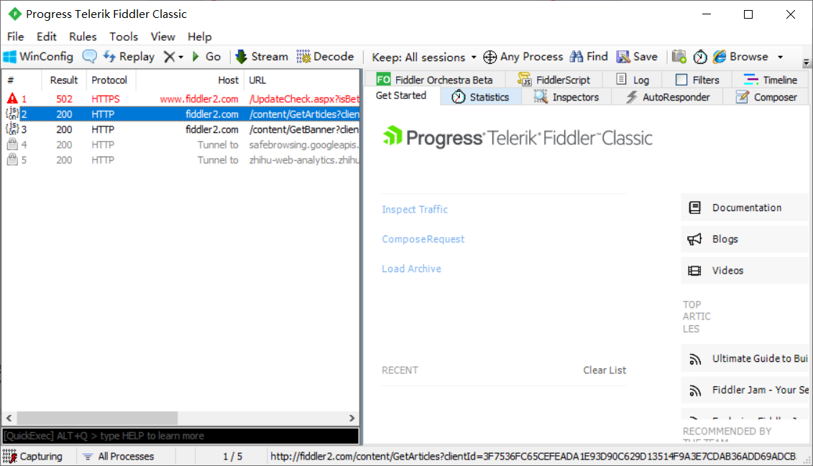

### 2.1.3. 语言

这里由于页面是英文的，如果看起来不是太方便，可以使用汉化包进行汉化，不过这个汉化和没汉化基本上是一致的，子选项都是没汉化的，至于如何使用可以看压缩包中的使用教程。

[fiddler补丁包](https://pan.baidu.com/s/1c_nD9ynaoUAkzVoaaeHOqA?pwd=vqj5)提取码：vqj5 


## 2.2. 安装模拟器

我这里使用的是夜神模拟器，并且把版本调整到安卓7.0版本，下载安装我就不说了，同时官网连接我也不放了，这个官网应该都能找到。

### 2.2.1. 调整版本

默认下载下来可能都是比较高的版本，这里我调整一下版本，打开夜神模拟器助手，这个是连同模拟器是默认一起安装的，点击右下角添加模拟器》选择Android7.0(至于位数随便)点击完就会自动下载与安装，然后开机即可。


### 2.2.2. 调整页面

刚下载下来的模拟器是平板模式，建议调成手机模式。


### 2.2.3. 调整网络

这里的调整网络是不要设置成网桥模式，这里一定不要调成网桥模式，包括后面如果调试完网络不通，请排查一下是否调整为网桥模式了。


# 3. 安装证书

这里安全证书的原因的是由于在抓包过程中可能会产生https这类协议，而这类数据包需要使用到证书来进行许可。

但是设备是android 7.0+的系统同时应用设置targetSdkVersion >= 24的话，那么应用默认是不信任安装的Fiddler用户证书的，所以你就没法抓到应用发起的https请求，然后你在Fiddler就会看到一堆200 HTTP Tunnel to xxx.xxx.xxx:443的请求日志，这些都是没有成功抓取的https请求。

下面的办法就是将Fiddler证书装到系统证书目录下，伪装成系统证书，那么就不存在因为fiddler证书不被信任而无法抓包的问题了。

[参考链接](https://blog.csdn.net/qq_43278826/article/details/124291040?spm=1001.2014.3001.5506&share_token=685896bd-615a-46ad-8d4b-745efef85baf)

## 3.1. FiddlercertMaker工具下载

fiddlercertMaker是`Bouncy Castle证书生成器`，因为新版本的Android拒绝超过两年有效期的证书，双击下载好的`fiddlercertmaker.exe`（确保已关闭Fiddler），会弹出提示导入证书成功这个对话框如果弹出的内容是什么版本不对，请下载最新的版本。

[fiddlercertMaker下载](http://www.telerik.com/docs/default-source/fiddler/addons/fiddlercertmaker.exe?sfvrsn=2)

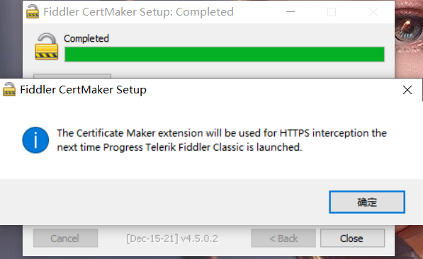

### 3.1.1. Fiddler设置

这里点击>`tools`>`options`>`https`>该勾选勾选，出现弹窗选择`yes`，在`https`旁边的`connections`中是设置端口的，默认是8888，如果不修改就这样吧。


### 3.1.2. 导出证书

点击`Tools` -> `Options` -> `HTTPS` -> `Actions` -> `Export Root Certificate to Desktop`，导出后在桌面上就能够看到一个证书，届时我们就需要使用到这个证书。

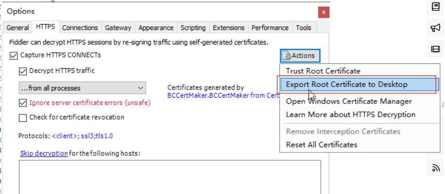

## 3.2. 下载Window版openssl

下拉到下面，选择最上面的64位EXE点击下载安装即可。

[openssl下载](https://slproweb.com/products/Win32OpenSSL.html)


### 3.2.1. 添加环境变量

这里需要在cmd中执行，所以需要添加一个环境变量。


### 3.2.2. 执行命令

这里在cmd中中心`openssl`如果有返回信息，那么就证明操作成功了。


## 3.3. 证书格式转换与重命名

### 3.3.1. 转换为pem证书

将Fiddler `cer证书`转`pem证书`，在cmd输入如下命令进行转换：

```
openssl x509 -inform DER -in FiddlerRoot.cer -out FiddlerRoot.pem
```


### 3.3.2. 查看MD5

从下面可以看到，咱们生成Fiddler证书的hash值是`e5c3944b`

```
openssl x509 -inform PEM -subject_hash_old -in 证书.pem
```


### 3.3.3. 重命名pem证书

在桌面上就能够看到一个e5c3944b.0的证书。

```
ren FiddlerRoot.pem e5c3944b.0
```


## 3.4. 上传证书

这里就需要将证书上传至模拟器中，这里准备一台Android7.0的模拟器。

### 3.4.1. 传输证书

点击夜神模拟器侧边栏的`电脑图标`，选择`打开电脑文件夹`，会跳转打开电脑的目录`C:\Users\Administrator\Nox_share`，将转换好的`Fiddler证书e5c3944b.0`复制到`ImageShare`目录下即可


### 3.4.2. 移动证书

下载[MT管理器](https://coolapk.com/apk/bin.mt.plus)，拖拉到模拟器中安装完成，点击打开应用，左边打开Pictures目录就可以看到刚才电脑`ImageShare`目录的`Fiddler证书e5c3944b.0`

这里下载完MT管理器将APK文件上传到模拟器中即可。


### 3.4.3. 转移目录

右边点击进入到`system/etc/security/cacerts`目录，然后长按左边的`e5c3944b.0`文件，点击复制即可复制到右边打开的目录那里。

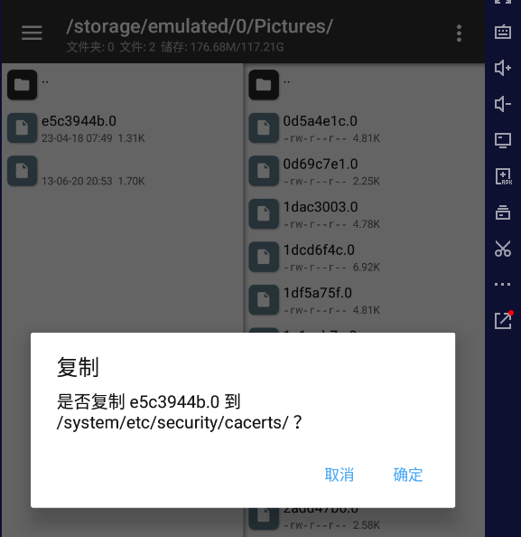

### 3.4.4. 添加权限

你会发现跟其他已有的系统证书相比，`e5c3944b.0`根本就没有读的权限，到时你到`信任的凭据`也是没法找到这个Fiddler证书的，点击`MT管理器`的左上角，找到`打开终端`

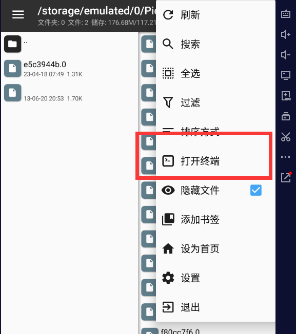

进入到终端之后，输入以下命令将`e5c3944b.0`文件设置为可读即可。


再看看`system/etc/security/cacerts`目录下`e5c3944b.0`文件的权限，发现确实有读权限了

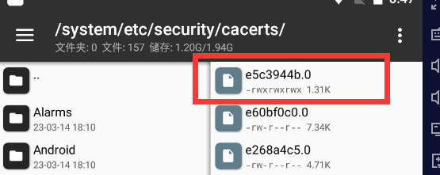

### 3.4.5. 查找证书

点击模拟器的`设置` -> `安全` -> `信任的凭据` -> `系统`，往下拉终于看到咱们的Fiddler证书，尝试一下抓包也是没问题了。


## 3.5. 模拟器代理设置

这里设置完代理就可以进行抓包了。

### 3.5.1. 设置网络

`设置`->`WLAN`->`长按网络`->`修改网络`->`保存`，这里的代理IP需要写入电脑的IP地址，端口就是fd的设置端口，默认为8888，当设置完后，会发现无法上网，那么这里就需要将将Fiddler重启，一般重启就好了，再不行重启电脑也能解决。


### 3.5.2. 抓包测试

这里我在夜神模拟器中的游戏中心打开一个游戏下载页面，可以看到成功获取到页面中的图片信息，并且也是https的理流量，同时也能够获取到http的流量。

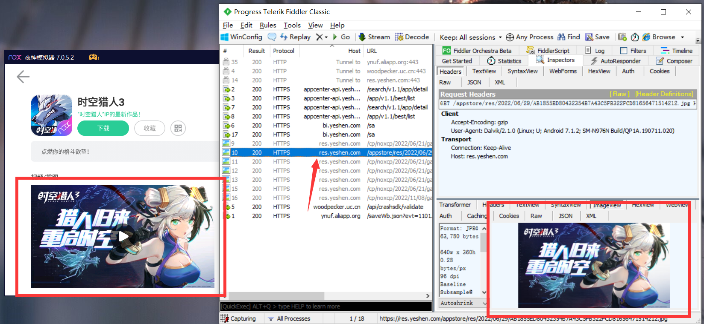

# 4. APP应用信息收集

在正常的WEB渗透测试过程中第一步就是对网站进行信息收集，那么在APP渗透测试中同样第一步也是信息收集，只不过APP的信息收集相较于WEB信息收集有点不同，由于APP都是封装起来的，所以需要对APK文件进行反编译或者在访问APP的时候进行抓包来获取访问的域名、端口、参数等信息。

## 4.1. AppInfoScanner项目

AppInfoScanner是一款适用于以HW行动/红队/渗透测试团队为场景的移动端(Android、iOS、WEB、H5、静态网站)信息收集扫描工具，可以帮助渗透测试工程师、攻击队成员、红队成员快速收集到移动端或者静态WEB站点中关键的资产信息并提供基本的信息输出,如：Title、Domain、CDN、指纹信息、状态信息等。

[AppInfoScanner项目](https://github.com/kelvinBen/AppInfoScanner)

### 4.1.1. AppInfoScanner依赖库

这里首先将文件下载下来，这里的下载我就不演示了，下载完毕后，需要先下载一下依赖库，我这里的截图是已经安装完成的提示，显示是已满足要求。

```
python -m pip install -r requirements.txt
```

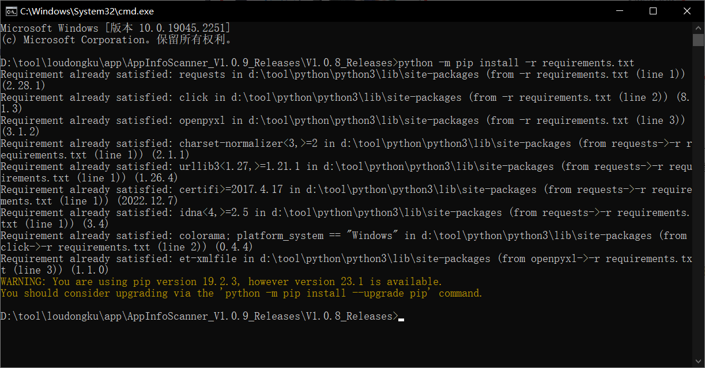

### 4.1.2. AppInfoScanner使用

这里我随便找了一个apk文件，注意哦，最好不要拿大厂的APP软件来进行测试，最好找一些非法的，我这里使用的就是某妃.....

从获取到的信息中就能够提权到相关的URL地址，可以拿这些URL地址进行测试。

同时一般大厂制作的APK程序可能都会加壳，小厂商就不一定了，加壳主要作用就是防止别人随意修改APK文件，或者进行破解等，避免别人乱搞。

```
python app.py android -i <Your apk file>  
```

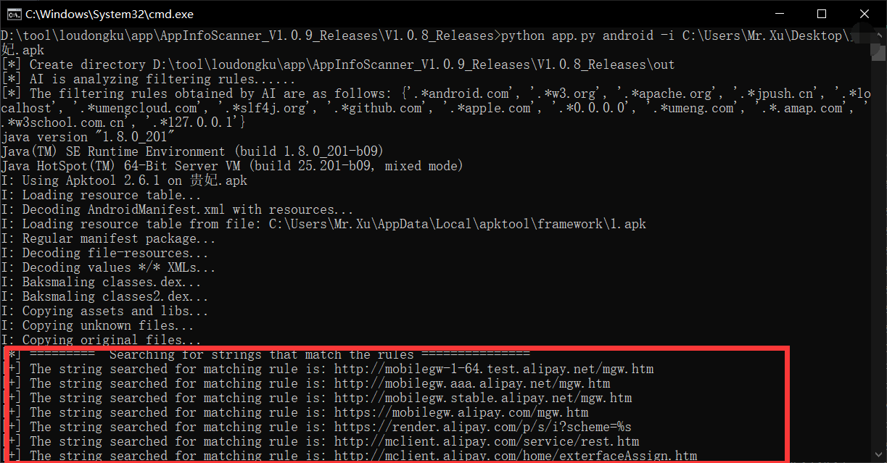

### 4.1.3. 验证URL

这里有点尴尬的是，某妃好像不提供服务了，所以网站都已经关闭了，不过还是找到一些内容，看到这些线路，相比应该都懂是什么了吧。

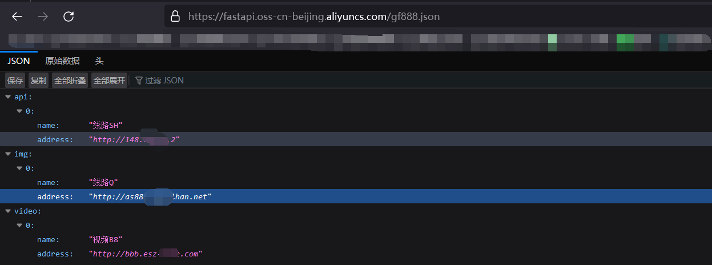

### 4.1.4. 总结

通过这个工具能够在不抓包的情况，通过APK文件获取到应用包中会访问的网站地址，URL地址，通过这些地址在进行深层次的渗透测试。

当然拉也可以用上面提到的FIddler进行抓包获取这些域名，但是需要一个一个项目去点击才能够实现，但是所有工具不是百分比都吧包内的数据获取全的。

## 4.2. APK反编译

关于反编译方面使用到的软件及工具其实也很多，但是很多都不更新了，例如Android killer、安卓修改大师等等。

安卓修改大师好像是复活了，但是要求呀，而且网上虽然要很多破解版，但是我测试了好多，都无法激活成功，同时在之前安卓修改大师疑似存在供应链病毒感染，可能最新版的已经解决了，但是没有最新版的破解，好多都是挂羊头卖狗肉，说是10+的版本，但是下载后都是8+的版本，同时下载后，软件就开始调用cmd，这也是比较疑惑了，运行起来调用也就罢了，都没打开就开始调用，所以我也就没有使用。

Android killer是2020.9月就不更新了，本次也还是拿这个来演示吧，主要是介绍一下反编译获取到的内容，不一定就非要用这个，比较不是专业搞破解的。

当然网上还是有很多APP反编译的工具的，这里我就不介绍了，可以自行百度搜索。

### 4.2.1. Android killer下载

[Android killer](https://github.com/liaojack8/AndroidKiller)

### 4.2.2. 基础配置步骤

在下载好的Android killer，需要进行一些配置才能够使用。

#### 4.2.2.1. 配置java

第一次打开会显示配置java SDK环境，暂时不用管他。

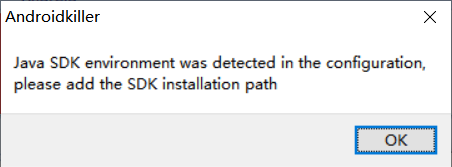

进来后，是英文的，这时候点击配置在常规中能够看到调整语言的选项，调整后重启即可，这里配置java，最好是1.8的java。


#### 4.2.2.2. 更新替换Apktool

这里需要先更新一下Apktool，直接去官网下载最新的然后替换即可。

[Apktool下载](https://ibotpeaches.github.io/Apktool/)

这里可以看到在根目录下有一个`bin`>`apktool`>`apktool`就能够看到一个`apktool_2.4.1`，用最新的替换它,我这里下载后最新的是2.7.0版本的。


#### 4.2.2.3. 修改相关信息

修改`AndroidKiller`根目录下的`bin`>`apktool`下的`apktool.bat`和`apktool.ini`文件。

修改apktool.bat，替换里面的原先的apktool_2.4.1.jar，替换后为apktool_2.7.0.jar。


这个也是同理。

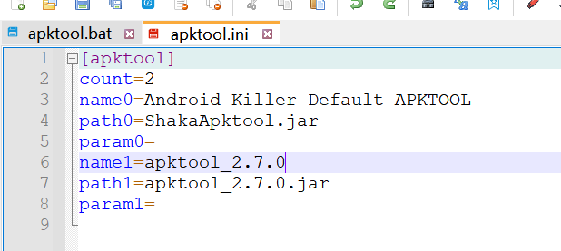

#### 4.2.2.4. 修改APKtool

这里修改上面后，测试并不行，需要在这个管理器中添加一下才可以，不然会报错。


### 4.2.3. 使用

很详细的反编译我也不是太懂，我们需要的只是获取APP中相关信息，主要其实就是一些IP把页面转换为web界面来进行渗透测试而已。

#### 4.2.3.1. 工程搜索

直接将下载下来的APK文件拖入进去分析即可，然后在工程搜索就可以找http://或者https://开头的地址了。


#### 4.2.3.2. 工程管理器

在工程管理器这里也可以看到很多页面，可以点击进去看看，比如这里就看到了很多的IP地址等。


### 4.2.4. 加壳

在一些大公司开发的APP中基本上都会加壳，就是为了避免被破解或者反编译，如果加壳了，那么就需要进行脱壳，当然也有很多一键脱壳的，但是可能会存在一些问题，这些就没办法了，只是提供一个思路。

当然这里也可以直接使用一些查加壳的工具，有壳如果你是授权的，其实可以直接找人家测试，如果非授权的，并且不是太懂APP开发的这些，就........


## 4.3. Fiddler信息收集

关于这个fiddler信息收集，其实就是抓包，直接看效果吧。

不过这里还是需要在提一嘴，我发现模拟器关闭后，再重启发现Fiddler无法抓包了，直接就获取不到数据了，后来我排查了一下是我再宿舍的网和办公室的网络的IP是不一样的，替换后重启依旧无效，后来又把模拟器关闭代理让其能够上网，然后再去设置代理，同时候又重启Fiddler才行，所以在Android7.0以上抓包还是比较麻烦的，同时问题也多，但是有没办法。

### 4.3.1. 获取数据

这是我测试某妃的时候打开获取到的数据，其实能够看到php的版本、IP地址、URL等信息，这些都足矣用来进行渗透了。


### 4.3.2. IP地址利用

这里获取到IP地址了，那么是不是可以利用这个IP地址进行渗透测试呢，可以利用一些在线端口扫描等进行测试。


## 4.4. 封包监听

在部分情况下可以不同设置代理就可以监听访问的地址与端口，类似于本地使用火绒剑，这里工具一样，我这里使用的夜神模拟器，但是一打开封包监听，工具就自动退出，可能是不能使用吧，雷神模拟器好像能用。

这里我放工具的链接，里面也有相关的教程。

[封包拦截器](https://www.52pojie.cn/thread-1446781-1-1.html)

## 4.5. APK资源提取

在某些情况下可能获取不到APK文件的提取，那么就需要使用到APK资源提取工具，这里网上工具很多，我这里就截个图，但是好用的APK资源提取暂时没有看到，所以就不提供了，这里看一下效果吧。

### 4.5.1. 提取

这里就是将获取不到的APK文件，打包一下，打包完就可以获取了。

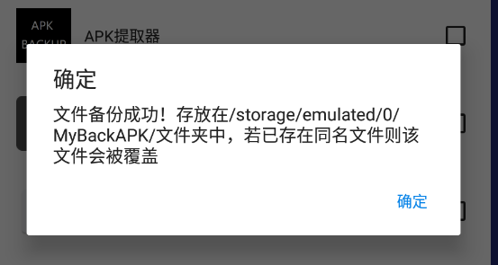

### 4.5.2. 查看资源

这里其实可以通过解压缩方式将APK文件进行解压出来，解压出来后就能够看到相关的APK资源了。


# 5. 小程序抓包

在小程序抓包这里，其实有点麻烦哦，由于微信问题，有些情况下是抓不到包的，同时默认情况下Fiddler抓到的包都是http的，如果想要抓到https的就需要将证书安装在默认浏览器中。

## 5.1. 安装证书

这里安装证书一定要在`控制面板`中打开`internet选择`进行安装证书，同时在安装的时候一定要选择`受信任的根证书颁发机构`,这样安装的证书才有效果。

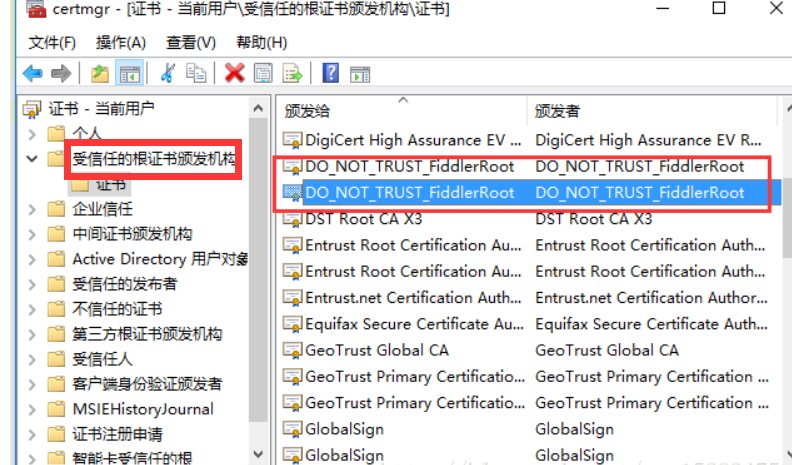

## 5.2. 抓包测试

这里安装好证书后，就可以进行抓包测试了，至于信息收集，我这里就不赘述了，和APP的信息收集方式是一样的。


