# 1. 前言

在之前的第一篇文章中简单的描述了一下微信小程序抓包的过程，但是不是很详细，所以这里单独写一篇关于微信小程序抓包、解包、反编译的一篇文章。

这里对小程序进行抓包、反编译等操作，都是为了进行信息收集，主要就是提取资产进行渗透测试。

# 2. 小程序抓包

不管是在真机还是模拟器中在安卓系统上抓包，可能会存在以下问题：

- 安卓系统 7.0 以下版本，不管微信任意版本，都会信任系统提供的证书
- 安卓系统 7.0 以上版本，微信 7.0 以下版本，微信会信任系统提供的证书
- 安卓系统 7.0 以上版本，微信 7.0 以上版本，微信只信任它自己配置的证书列表

相应的解决办法就是如下：

- 将证书安装到系统证书中（需要 root）
- 苹果手机（苹果手机不受此影响）
- 采用安卓系统低于 7.0 的模拟器

## 2.1. 安卓系统5.0版本测试

这里我使用夜神安卓系统5.0版本进行测试。

### 2.1.1. 添加模拟器

这里只需要在模拟器助手中点击添加模拟器，选择安卓5即可。

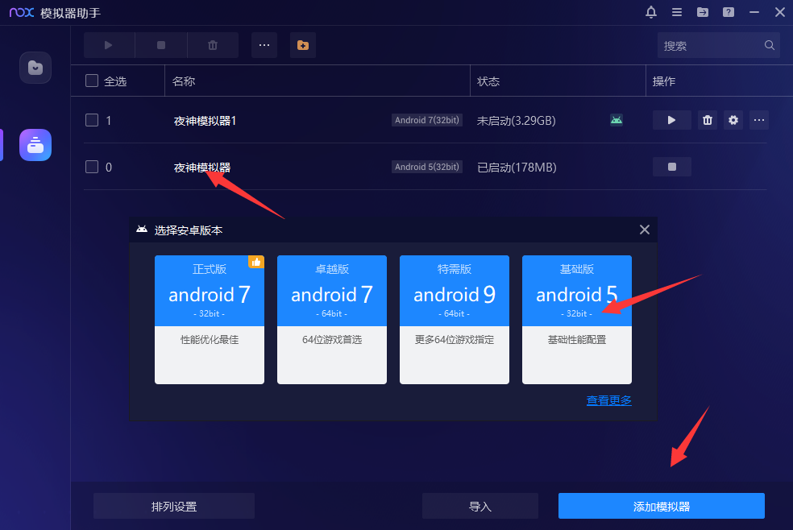

### 2.1.2. 安装证书

这里使用`Burp`来进行抓包，至于`Fiddler`在之前已经提过了，这里就不再提了。

#### 2.1.2.1. 确保在同一局域网

关于如何确保在同一局域网这方面我就不再赘述了，之前的文章中也是多次提到，这里我们直接设置`burp`工具。

#### 2.1.2.2. 设置burp工具

首先打开`burp`，添加一个监听端口，这里的`监听IP`要与你`主机的IP`是一致的才可以。

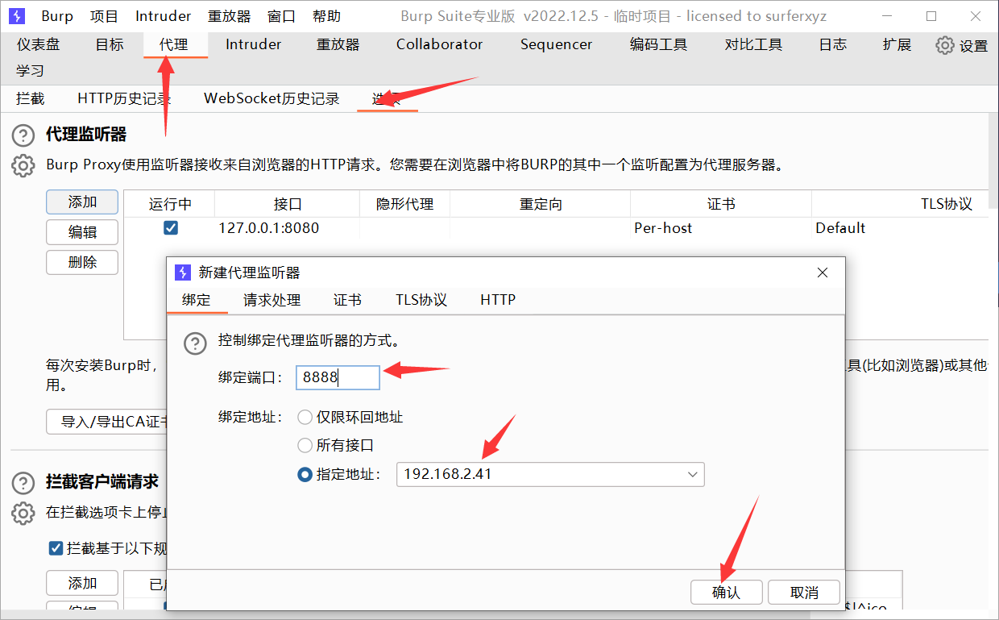

#### 2.1.2.3. 设置模拟器代理

这里进入`WIFI``长按WIFI``设置代理`，这里的`IP地址`也同样是`主机的IP地址`，`端口`需要和`burp`工具上的端口对应，详细的教程可以看之前的文章，之前的文章中有非常详细的介绍。

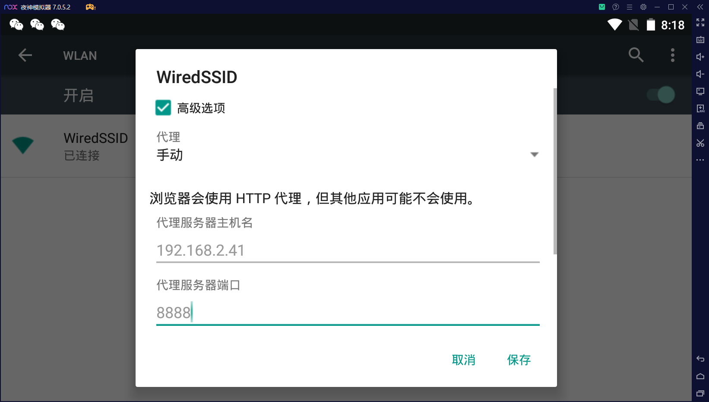

#### 2.1.2.4. 下载证书

这里就需要安装`burp证书`了，访问`IP:端口`，即可下载证书。

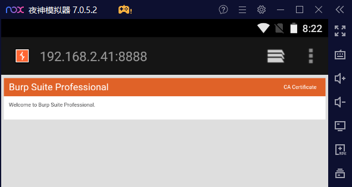

#### 2.1.2.5. 修改证书

证书下载完之后，需要将下载的证书` cacert.der` 修改为`cacert.cer`，否则无法安装证书，下载后打开模拟器共享，就能够看到这个证书了，这里将`cacert.der` 修改为`cacert.cer`即可。

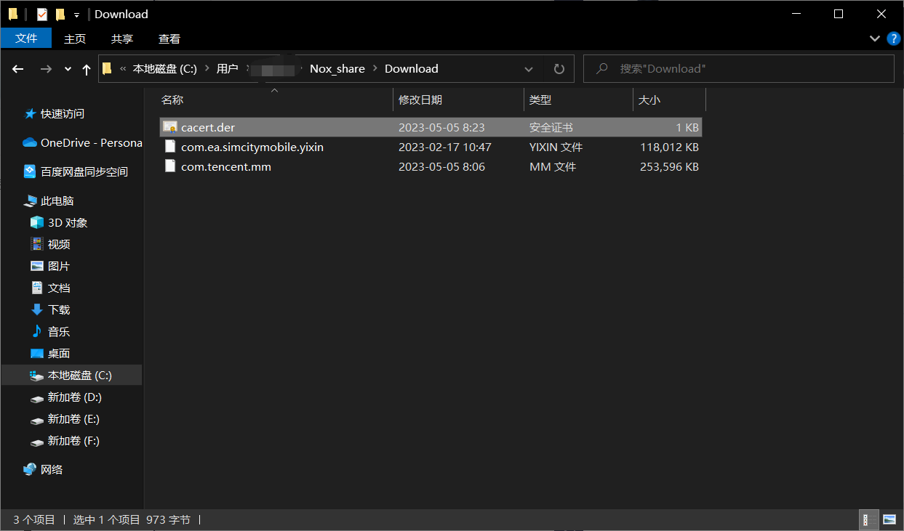

#### 2.1.2.6. 安装证书

这里需要提前找到证书存放的位置，可以去按照共享中找一找。

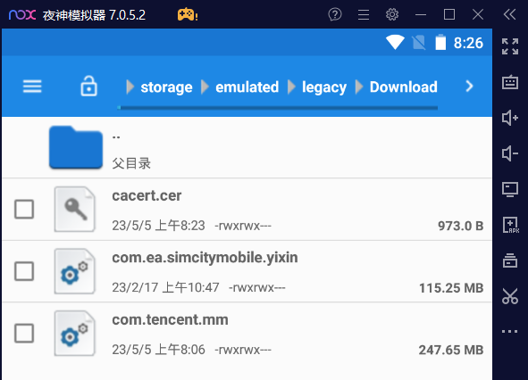

打开`设置`—`安全`—`从SD卡安装`—`cacert.cer`—`设置一个密码`—`为证书命名`—`确定`—`证书就安装了`，这里我没截到图，我用之前的图片代替一下。

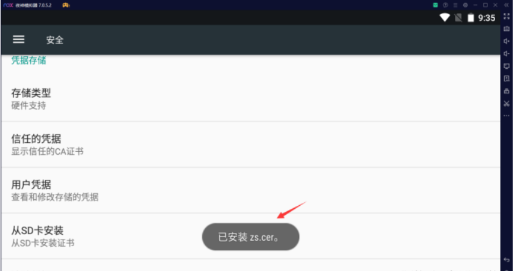

### 2.1.3. 抓包测试

在我们把证书按照完成后，就可以进行抓包测试了，这里可以看到已经抓到包了。

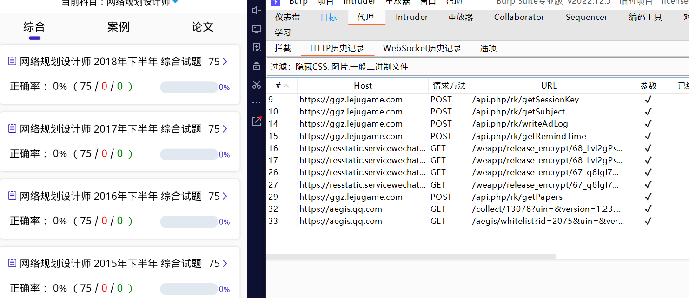

## 2.2. 电脑版微信抓包

在电脑版中进行小程序抓包，其实也是可以的。

### 2.2.1. 下载证书

这里使用`Fiddler`来抓电脑版微信小程序的包，由于我看了一下使用`burp`老是会跳，并不会停留，虽然也能够抓取到，但是一瞬间就消失了，所以还是使用`Fiddler`来抓取。

这里选择第二个就会在桌面上生成一个证书。

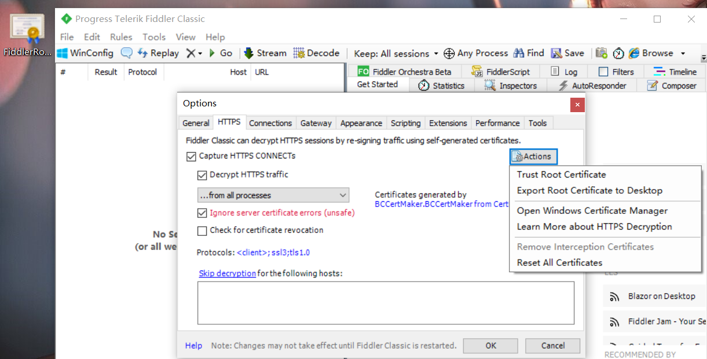

### 2.2.2. 安装证书

这里需要将`Fiddler`的证书安装到浏览器中，注意这里安装证书一定要在`控制面板`中打开`internet选择`进行安装证书，同时在安装的时候一定要选择`受信任的根证书颁发机构`,这样安装的证书才有效果。

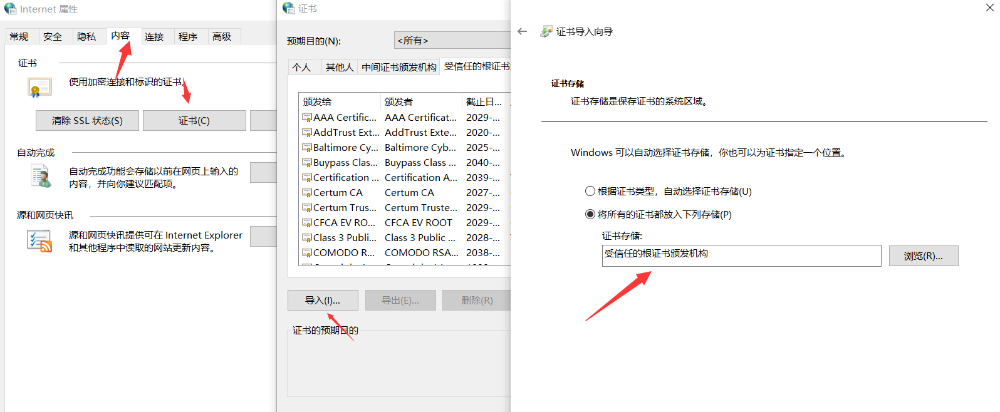

## 2.3. 尝试抓包

这里其它的设置，看了那么多篇APP渗透测试，想必一些常见的设置都会了，这里我就不在赘述了，直接开始尝试抓包。

### 2.3.1. 微信设置代理

这里需要在微信的登陆页面设置代理，IP地址就是你主机的IP地址，端口与Fiddler中设置的是一样的即可，这里点击确定后会自动显示是否能够连接成功，一般都会显示连接成功的，如果显示连接不成功请提前将Fiddler打开。


### 2.3.2. 登陆微信

这里就只需要登陆微信，在登陆过程中其实就能够看到有很多的数据包了。


### 2.3.3. 抓取小程序

这里就可以抓取小程序了，不过最好可以将之前的数据包删除，这里可以看到我打开了逆水寒手游，获取到https的信息，那么这样就是获取成功了。


### 2.3.4. 注意事项

在一些情况下，你会发现之前还是能够获取好好的，突然无法获取了，这个由于你使用电脑版微信在登陆一下小程序后。

这时候就需要将`C:\Users\Administrator\AppData\Roaming\Tencent\WeChat\XPlugin\Plugins\WMPFRuntime`这个目录下的所有文件夹都清空，这个文件夹主要就是加载小程序的。

这里是我提前删除了。

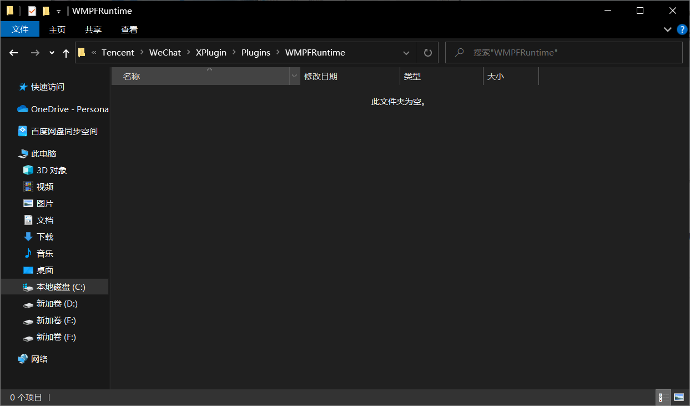

# 3. 小程序分包反编译

关于小程序的分包反编译，目前没有特别好的免费工具来进行，好的工具都需要充值vip。

## 3.1. 小程序缓存目录

找到微信小程序的缓存目录，当然里面会存在很多的文件夹，可以都删除，然后打开一个小程序加载。

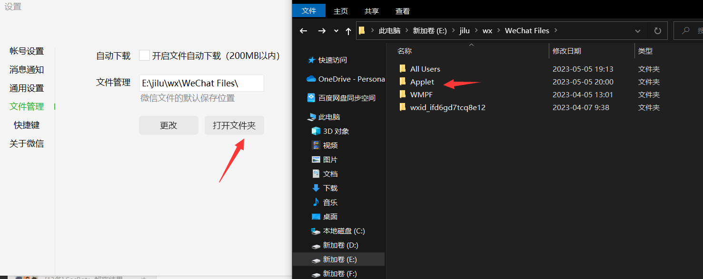

## 3.2. 尝试加载小程序

这里我们只点击一个小程序加载，太多的话容易搞混，在wx开头的文件夹下面会有一个后缀为wxapkg文件，这个文件就是小程序编译后的文件。

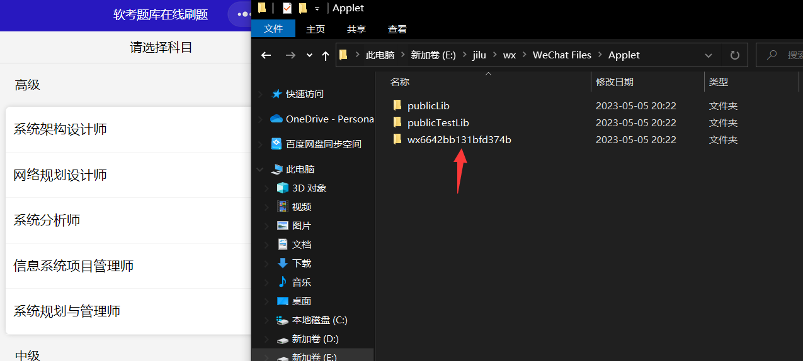

## 3.3. 尝试反编译小程序

这里我们就尝试手动反编译吧，不过会存在问题哦，不一定是百分比能够成功的，毕竟像之前说的好工具是要钱的，尝试找破解版的，但是没用。

### 3.3.1. 安装nodejs

这里我不知道我是什么时候安装的，可能安装的工具多了就曾经在某一刻是安装过的，这里我就不再安装了，给个连接自行安装吧。

[nodejs](https://nodejs.org/zh-cn/download)

安装后打开cmd输入`node -v`看到显示版本就证明安装成功了。


### 3.3.2. 解密小程序

这里我们将加密的小程序添加进去，然后在wxpack文件夹中找到刚刚解密的文件夹即可。

[解密小程序](https://pan.baidu.com/s/1lEcUJb3YlP4rgqitpjS3bg?pwd=tncx)提取码：tncx 

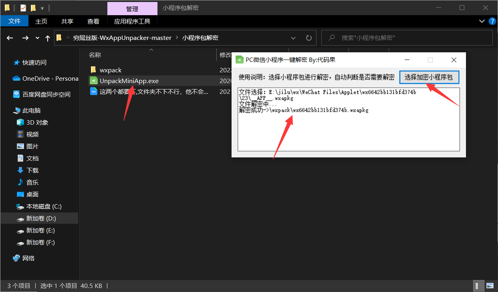

### 3.3.3. 反编译脚本

打开反编译脚本，将刚刚解密后的文件放入该目录下。

[反编译脚本](https://pan.baidu.com/s/1VCxqWhx6jaOmdlSThFthTw?pwd=031b)提取码：031b 

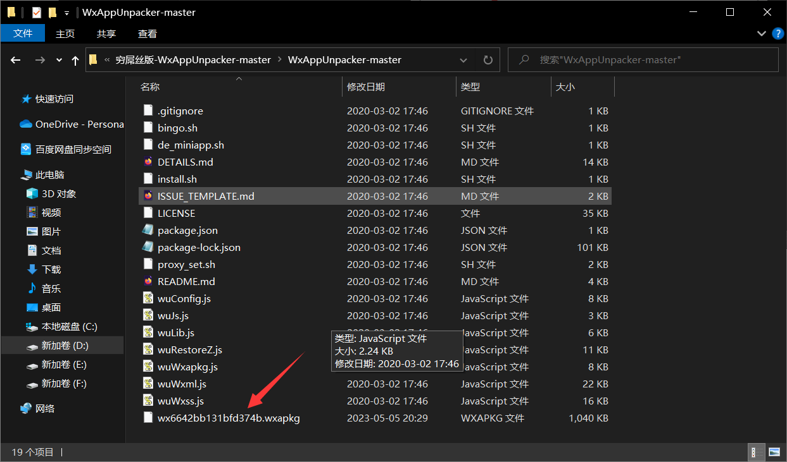

#### 3.3.3.1. 安装依赖

这里就需要先在反编译脚本目录下安装依赖，这里挺麻烦的，但是没办法呀，穷买不起会员，无法一键反编译。

```
npm install esprima
npm install css-tree
npm install js-beautify
npm install uglify-es
npm install vm2
npm install cssbeautify
```


#### 3.3.3.2. 执行反编译

如果上面一切顺利的话就可以执行反编译了。

```
node wuWxapkg.js wx6642bb131bfd374b.wxapkg
```

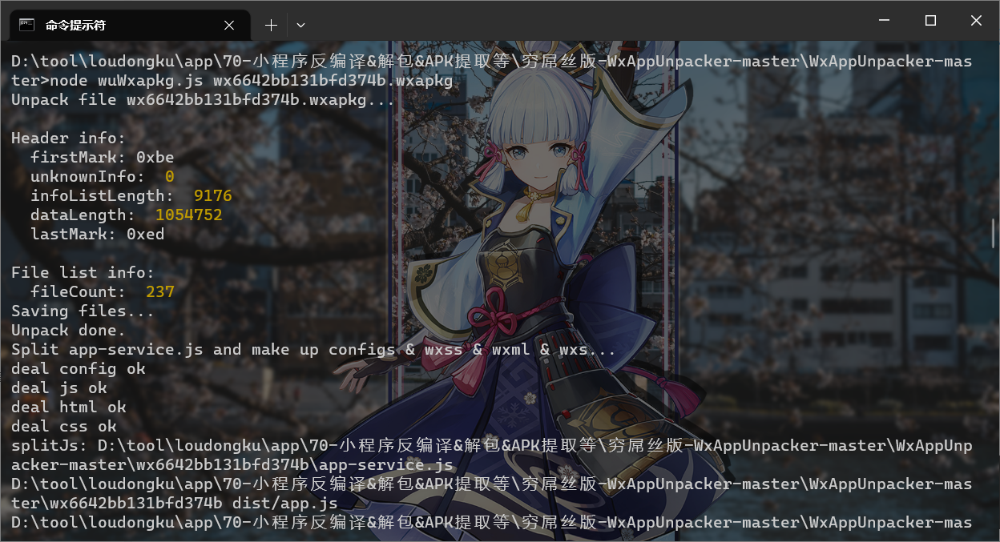

### 3.3.4. 查看反编译后文件

这里我们就可以在当前目录下查看对应的反编译文件夹了,看到后就可以使用微信开发者工具打开了。

[微信开发者工具](https://developers.weixin.qq.com/miniprogram/dev/devtools/stable.html)


### 3.3.5. 查看工程

到这里就可以将文件加入微信开发者工具的工程中了，不过这里需要申请一个测试账号，非常简单，无需什么麻烦的操作。

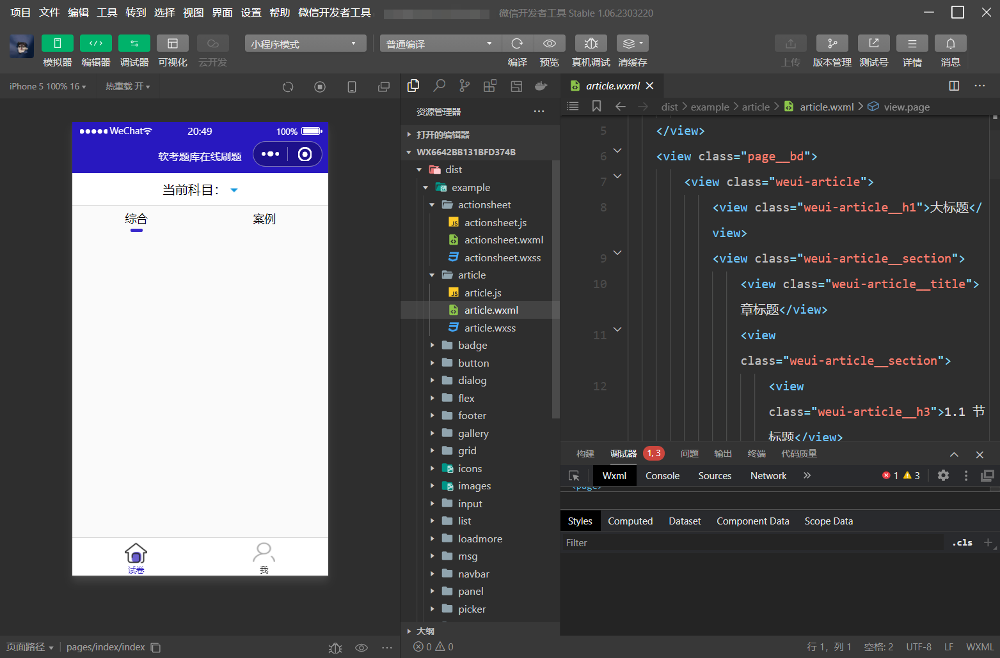